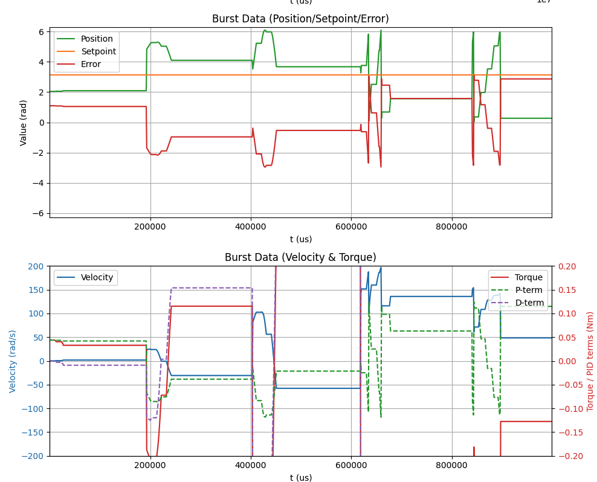
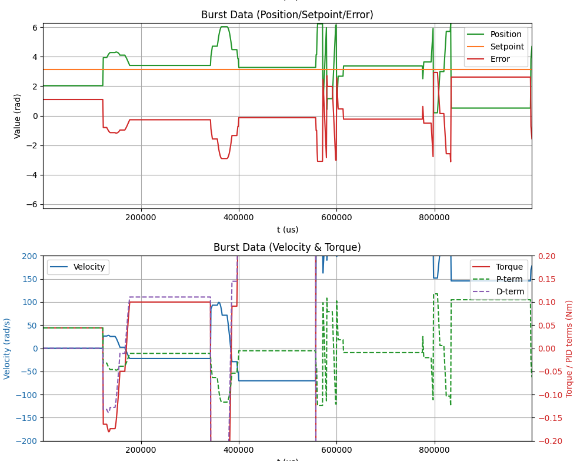

# Examples of PID working and not working

The way the code is set up is if the user hits the button we switch to a supervisor mode that sets the position
```c

  if (pb_state == PB_PRESSED) {
	// SPEAKER
	tone_start(&g_tone, PB_BEEP_HZ, PB_BEEP_MS, PB_GAP_MS);
      }
      else if (pb_state == PB_RELEASED && g_button.isArmed()) {

	// User can switch mode by pressing button
	SupervisorMode test_mode = SUP_MODE_SET_POSITION;

	if (supervisor.mode == test_mode) {
	  supervisor.mode = SUP_MODE_IDLE;
	} else {
	  supervisor.mode = test_mode;
	}
   }
```

Using this code block, and many different settings for Kp and Kd, I got no where with trying to get motor to move to position under PID control. 

```c
void run_mode_set_position(Supervisor_typedef *sup,
                           FlexCAN_T4<CAN1, RX_SIZE_256, TX_SIZE_16> &can) {
    static bool first_entry = true;
    static unsigned long start_time = 0;

    const float Kp = 0.04f;
    const float Kd = 0.005f;
    const float setpoint = M_PI;   // target position

    if (first_entry) {
        logIndex = 0;
        first_entry = false;
        start_time = micros();
    }

    // --- PID control ---
    float pos_err = setpoint - sup->esc[0].state.pos_rad;
    if (pos_err >  M_PI) pos_err -= 2.0f * M_PI;
    if (pos_err < -M_PI) pos_err += 2.0f * M_PI;

    float vel_err = 0.0f - sup->esc[0].state.vel_rad_s;

    float p_term = Kp * pos_err;
    float d_term = Kd * vel_err;
    float cmd_torque_raw = p_term + d_term;

    // clamp torque
    const float TORQUE_CLAMP = 0.8f;
    float cmd_torque = constrain(cmd_torque_raw, -TORQUE_CLAMP, TORQUE_CLAMP);

    // --- Output command over CAN ---
    CAN_message_t msg;
    msg.id = canMakeExtId(CAN_ID_IQREQ, TEENSY_NODE_ID,
                          sup->esc[0].config.node_id);
    msg.len = 8;
    msg.flags.extended = 1;
    canPackFloat(cmd_torque, msg.buf);
    canPackFloat(0.0f, msg.buf + 4);
    can.write(msg);

    // --- Logging ---
    if (logIndex < 1000) {
        logBuffer[logIndex++] = {
            micros() - start_time,
            setpoint,
            sup->esc[0].state.pos_rad,
            sup->esc[0].state.vel_rad_s,
            pos_err,
            cmd_torque,
	    p_term,
	    d_term
        };
    } else {
        // Done collecting: print JSON burst
        Serial.println("{ \"samples\":[");
        for (int i = 0; i < 1000; i++) {
	  Serial.printf(
			"{\"t\":%lu,\"setpoint\":%.4f,\"pos\":%.4f,"
			"\"vel\":%.4f,\"err\":%.4f,"
			"\"torque\":%.4f,\"p_term\":%.4f,\"d_term\":%.4f}%s\r\n",
			logBuffer[i].t_us,
			logBuffer[i].setpoint,
			logBuffer[i].pos,
			logBuffer[i].vel,
			logBuffer[i].error,
			logBuffer[i].torque,
			logBuffer[i].p_term,
			logBuffer[i].d_term,
			(i < 999) ? "," : ""
			);

        }
        Serial.println("]}\r\n");

        // Reset and exit to idle
        sup->mode = SUP_MODE_IDLE;
        first_entry = true;
    }
}

```


## Resulting plots are here. This a sort of good example: 


## And these are sucktastic:



----



- very little reproducibility
- same settings produce different results
- major risk: going down rabbit holes you can consider all the issues [here](sept19_torque_nonlinearity.md)

## The good news is this, what I found was: 

- The teensy is running its control loop at 1 kHz but my configuratino of MESC sent data at 500 Hz.
- If you're not careful the teensy reused stale velocity samples
- The fix was to basically gate calculations, by adding this to the top of the control loop:

```c
if (!sup->esc[0].state.alive) return;
.
. rest of code
.
sup->esc[0].state.alive = false;

``` 
This only updates when fresh CAN message arrives.

This aligned Teensy’s control loop with ESC data → noise and D-term chaos disappeared.


## Parameterizing

- Checkout this hash a5a77bc746598f7f1fc24ee28c335967a3400e68 to reproduce.
- Load on to teensy.
- Load code [link](https://github.com/owhite/MESC_brain_board/tree/main/teensy40/PID_position) on to teensy
- Then run on the command line:
  - $ python3 ./position_burst.py /dev/cu.usbmodem178888901
- Set motor position.
- Hit button on brain board, or hit run on python interface.
- Changing PD settings saves to disk and sends start command to control plant. 
- Current outcome is discussed [here](sept23_PID_notes.md)

## Unfortunately, these have been simple no-load motor tests. 

- When the motor is spun with no load, the controller looks unstable and oscillatory even with small gains.
- No inertia or resisting torque — the rotor accelerates instantly, overshoots. 
- The feedback loop chases its own tail.
- Integral action is meaningless here (no steady disturbance to fight).
- This has been useful to verify plumbing: 
  - CAN messaging, encoder direction, logging
  - Confirming that P, I, and D terms work in principle.
- It tells you almost nothing about how the system will behave when stabilizing a real unstable plant like a balancing robot.

## What is actually needed is an inverted pendulum.

- The critical state is body angle (θ) and its rate (θ̇).
- Encoders on free-spinning wheels don’t give body tilt; an IMU is normally used.
- The new plan: inverted pendulum test rig

Mechanical setup:
- Mount an arm rigidly on the motor shaft, with a weight at the end.
- Motor shaft horizontal, arm pointing up → defines the unstable equilibrium.
- Add stops or bumpers so the arm can’t swing 360°.

Sensor setup:
- Use the motor’s encoder to measure arm angle.
- Define “relative zero” at the upright top position.

Control setup:
- Start with PD control:
- P-term provides restoring torque to pull arm upright.
- D-term damps oscillations.
- I-term only after P–D balance is stable, to cancel offsets (friction, misalignment).

In short: a free-spinning motor under no load is just a wiring check. An inverted pendulum on the motor shaft is a true physics test of your controller. It’s the right next step before putting code on the robot.
