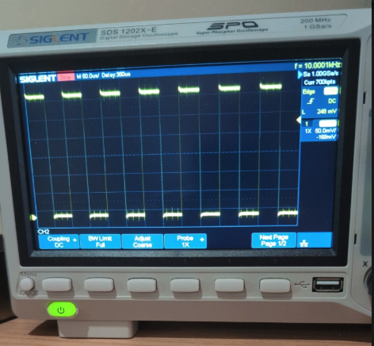
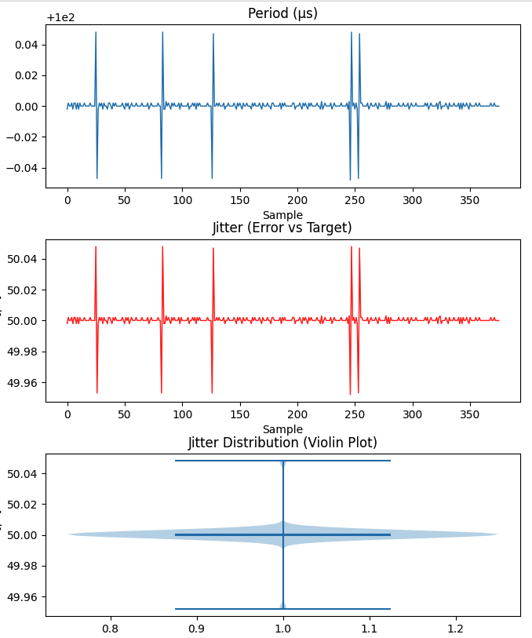
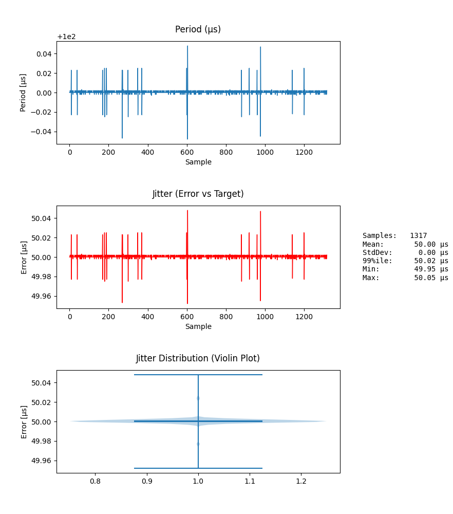

## Measuring fastLoop() Timing Jitter

### 1. Generating a Test Signal on the STM32F405 (MESC)

I added these functions to MESC code:

```c
// PB5 setup
static inline void jitter_pin_init(void) {
  RCC->AHB1ENR |= RCC_AHB1ENR_GPIOBEN; (void)RCC->AHB1ENR;

  GPIOB->MODER   = (GPIOB->MODER & ~(3U << (5U*2))) | (1U << (5U*2));
  GPIOB->OTYPER &= ~(1U << 5);
  GPIOB->OSPEEDR |= (3U << (5U*2));
  GPIOB->PUPDR &= ~(3U << (5U*2));
  GPIOB->BSRR = (1U << 5) << 16;
}

static inline void jit_set(void)    { GPIOB->BSRR =  (1U << 5); }
static inline void jit_clr(void)    { GPIOB->BSRR = ((1U << 5) << 16); }
static inline void jit_toggle(void) {  GPIOB->ODR ^= (1U << 5); }

```

Then with MESC_Firmware/MESC_Common/Src/MESCfoc.c

add this into the end of **fastLoop()**

```c
static inline void jit_toggle(void) {  GPIOB->ODR ^= (1U << 5); }
```

Put a scope on PB5 and get this:



### Result:
- **Each toggle = one call to `fastLoop()`**, so:
  - Square wave frequency = half the loop frequency.
- Example: observing ~10 kHz on oscilloscope → means `fastLoop()` executes at ~20 kHz.

---

### 2. Measure the output with the Teensy 4.0
- Connected ESC test pin → **Teensy pin 9** (interrupt-capable).
- On the brain board this is the PWM in header for reading an RC transmitter
- Teensy runs an **ISR on rising edges**:
  - Timestamps each edge with the **ARM cycle counter** (`ARM_DWT_CYCCNT`).
  - Stores timestamps into a **ring buffer** (ISR-safe).
- Main loop:
  - Computes **period (µs)** = time difference between edges.
  - Computes **jitter/error (µs)** = deviation from target period.
  - Outputs NDJSON over USB serial, e.g.:
    ```json
    {"seq":1234,"t_us":1234567.890,"period_us":50.0,"target_us":50.0,"err_us":0.05}
    ```

---

### 3. Host PC Logging & Plotting
- Python script reads Teensy’s serial NDJSON stream.
- Parses JSON lines and stores into rolling buffers.
- Plots in real-time using Matplotlib:
  - **Period vs. sample**
  - **Jitter vs. sample**
  - **Jitter histogram** (distribution shape)
  - **Jitter violin plot** (spread + density)

Run script:
```
python3 ./plot_teensy_jitter.py /dev/cu.usbmodem178888901
```

Typical result showing there is a very small amount of fastLoop() delays:



This example shows virtually no change after increasing CAN messages to 500kz:



---

### Outcome
- Jitter measured in **sub-µs range**, with only rare small spikes.
- Demonstrates loop timing is stable enough for deterministic FOC.
- Workflow (ESC pin toggle → Teensy capture → Python plots) provides a **portable jitter analyzer** for real-time firmware validation.
- This will be useful to test if other changes to MESC code have a negative impact
- CAN running at 500hz doesnt seemt to impact anything
