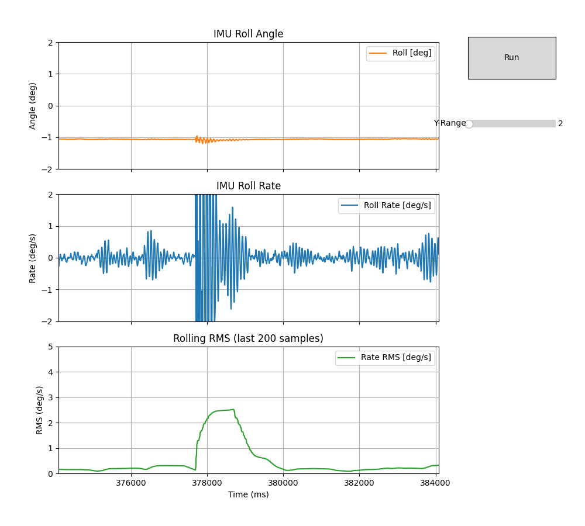
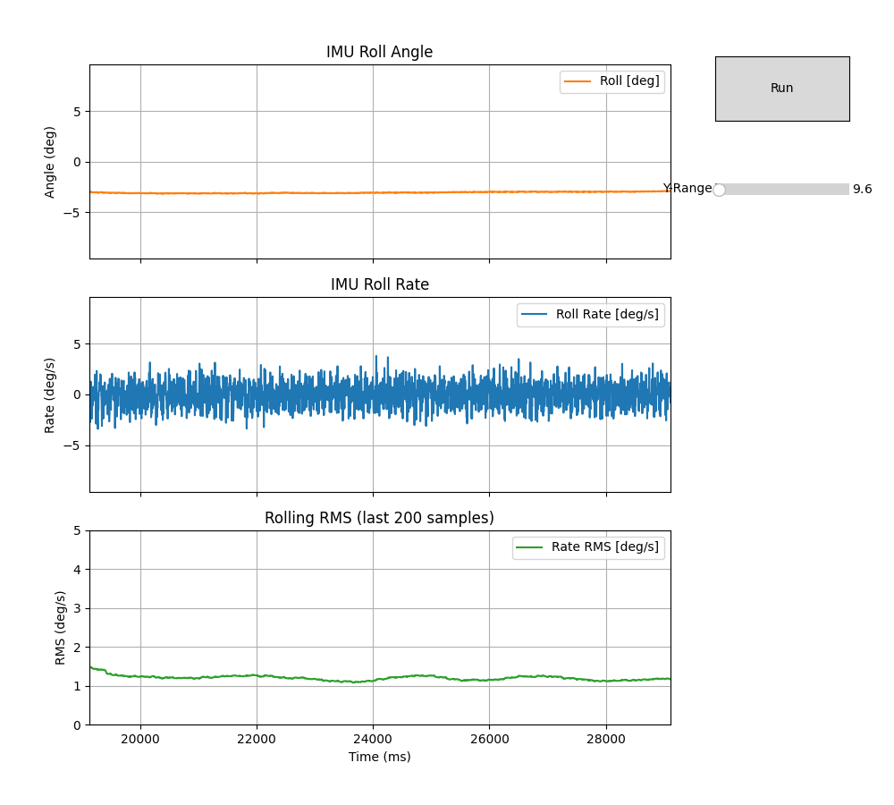

## Nov 16th, 2025

## Inertia Measurement Unit Testing

During bench testing of the Two-Wheeled Robot (TWR) control stack, the MPU6050 IMU exhibited significant vibration-induced noise when the motors were energized. The Teensy is executing the run_mode_balance_TWR() loop at 500 Hz, using IMU-derived roll and roll-rate feedback for the LQR controller.

When the motors are off, both signals are stable and near-DC, confirming correct sensor setup and minimal electrical noise. However, when the motors spin (with the robot frame fixed to a test board), the roll-rate signal shows ±1 deg/s jitter and small bias drift, indicating mechanical coupling of motor and chassis vibrations into the IMU.

```
$ ./IMU_test.py -p /dev/cu.usbmodem178888901
```


and this is with:


## Roll-rate root mean square:

**RMS (Root Mean Square)** is a statistical measure of signal energy. For IMU roll-rate data, RMS quantifies the **average noise level** of the gyro signal over a short window of time (e.g., 200 samples ≈ 0.4 s at 500 Hz). It compresses a noisy signal into a single scalar that reflects how “quiet” or “vibratory” the measurement is.

Because self-balancing robots rely heavily on roll-rate (θ̇) feedback, excessive noise directly affects controller stability, causes jitter in torque output, and can lead to oscillations or instability. RMS is therefore a useful indicator of **sensor quality, mechanical isolation effectiveness, and motor-induced vibration.**

Ideal operation would be:
- Motors off (idle):
- 0.05–0.20 deg/s RMS
- means a clean gyro data and low mechanical noise.
- Motors on, wheels off ground:
   - 0.20–0.50 deg/s RMS
   - Typical for a well-isolated IMU.

Acceptable but monitor:
- 0.50–1.00 deg/s RMS
- Some vibration coupling.
- Controller may still behave, but there could be torque “buzzing.”

Let's look at some data. Turn off the motors, and one hard desk bang causes this:



**This is good news.** If the robot receives a mechanical impact, the IMU reports a temporary rise in roll-rate RMS, up to ~2–3 deg/s. This is expected and represents real physical disturbance, not measurement noise. The RMS rapidly returns to baseline (≈0.1–0.3 deg/s), indicating low steady-state noise, adequate mechanical damping, and no problematic chassis resonance.

- RMS ~0.1–0.3 deg/s at steady state → Very clean IMU data.
- A fast rise in RMS up to ~2.5 deg/s.
- A clean decay back to baseline over ~200–400 ms.
- No lingering resonance.
- No secondary ringing.

Let's try it with the motors running: 



**This is also good news.**

- This is typical for a wheel-in-the-air test.
- Roll angle has small DC drift of a few degrees (normal due to chassis flex + IMU bias).
- No jitter or high-frequency artifacts.
- IMU orientation estimate is stable.
- Roll rate (raw-ish gyro rate), noise amplitude is roughly ±2–4 deg/s
- Centered around 0
- Broad vibration band → this is expected motor vibration, not sensor instability
- No strong narrow-band resonance → great sign
- No drift → bias stable
- Peak RMS ~3.3 deg/s at motor spin-up
- Settles to ~1.2–1.5 deg/s steady state
- Clean exponential decay after spin-up
- This RMS level is acceptable for control.

**General rules of thumb:**

| Condition                  | RMS (deg/s)    | Interpretation                    |
| -------------------------- | -------------- | --------------------------------- |
| **Excellent / motors off** | 0.1–0.3        | Ideal                             |
| **Good / motors on**       | 0.3–0.7        | Normal                            |
| **Acceptable**             | 0.7–1.5        | Usable                            |
| **Concerning**             | 1.5–2.0        | Needs checking                    |
| **Problematic**            | >2.0 sustained | Likely resonance or poor mounting |


## Additional filtering

A chunk of time has gone by and the **MPU6050 is behaving really poorly when the bot is trying to balance**. (Sorry, I did not make a graph of this). When the controller is on there is no way to get RMS down to a reasonable level, and almost as worse **readings for the tilt position of the robot were terrible**. This led to me switching to using an ICM-42688, and applying Mahony filtering. 

A Mahony filter is a lightweight, quaternion-based sensor fusion algorithm used to estimate 3-D orientation from an IMU. It combines gyroscope and accelerometer measurements in a way that:

- uses the gyroscope for smooth, low-noise short-term rotation tracking
- uses the accelerometer as a long-term reference for the gravity direction
- automatically rejects accelerometer readings that don’t match gravity (e.g., vibration, linear acceleration)
- continuously estimates and removes gyro bias so the angle does not drift over time

the filter compares the gravity vector predicted by the current quaternion to the gravity vector measured by the accelerometer. The difference becomes an error signal, which is fed back into the gyroscope via proportional (Kp) and integral (Ki) terms. The corrected gyro is then integrated into the quaternion.

Here is an example of running the bot with the wheels off the ground, but still chattering away. The full 3-axis Mahony filter produced a clean, stable pitch estimate that no longer drifts when the motors run. The filter automatically rejects vibration-induced accelerometer noise and uses gyro bias correction to keep the angle accurate over time. As a result, the robot’s tilt measurement is now smooth, responsive, and reliable enough for precise balance control.


