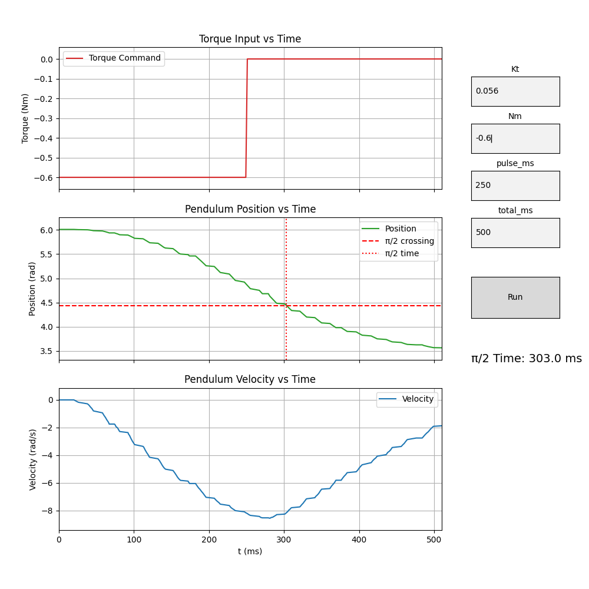
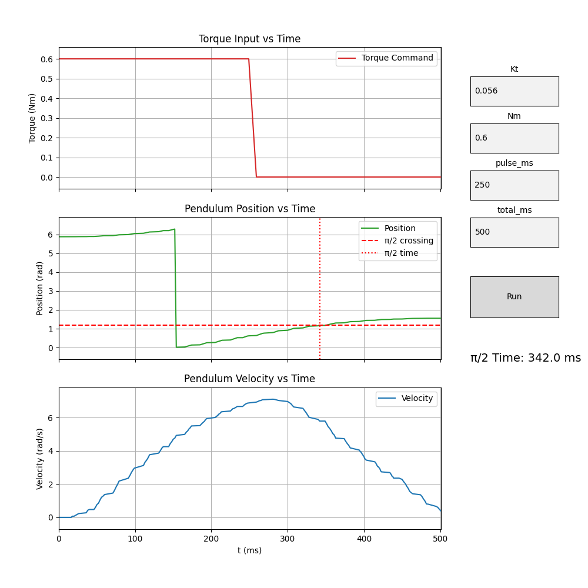

## Oct 03, 2025
## Modeling the Pendulum in PyBullet

See: [least_squares](sept30_least_squares.md)

### STL meshes were exported from Rhino3D and built a URDF description of the pendulum, including:
- Mass and inertia tensors (computed from STL volume/density).
- Center of mass offsets.
- A hinge joint defined at the top of the pendulum.
- A [modeling program](https://www.youtube.com/watch?v=Mqh3uTG2mss) visualizes both the joint position and center of mass (COM).
- Torque simulations uses PyBullet to life the pendulum
- Result: the simulation predicted ~150–220 ms to swing through a quarter turn with ~0.6 Nm

<iframe width="560" height="315" 
    src="https://youtube.com/shorts/aiBLkrTjKmU"
    title="YouTube video player" 
    frameborder="0" 
    allow="accelerometer; clipboard-write; encrypted-media; gyroscope; picture-in-picture" 
    allowfullscreen>
</iframe>


### Testing the physical system
- Sends current commands to the ESC (via serial JSON messages).
- Data from the Teensy logs torque, position, and velocity.
- Live plotting using Matplotlib animation:
- User sets: 
  - Torque constant (Kt).
  - Requested torque (Nm).
  - Pulse duration.
  - Total experiment time.

Launch the graphing program
```
$ ./torque_raise.py  /dev/cu.usbmodem178888901
```





### A full workflow!
- Models the pendulum’s mass/inertia in PyBullet.
- Predict torque requirements and timing in simulation.
- Run the real pendulum with ESC commands.
- Collects real data via serial.


