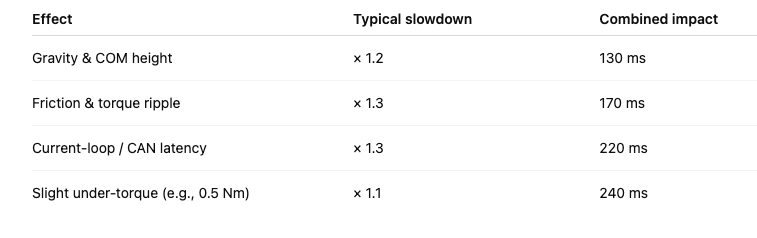
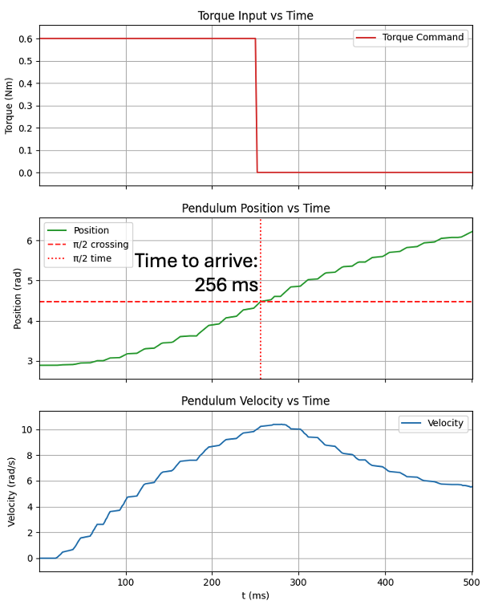

## Oct 03, 2025
## Modeling the Pendulum in PyBullet

### We have a full workflow:
- Create 3D objects in Rhino3d. 
- Export STLs to disk. 
- Model the parts mass/inertia in PyBullet.
- Predict torque requirements and timing in simulation.
- Drive the real pendulum by sending commands to MESC.
- Collects real data via serial.
- See: [least_squares](sept30_least_squares.md)

### STL meshes were exported from Rhino3D and built a URDF description of the pendulum, including:
- Mass and inertia tensors (computed from STL volume/density).
- Center of mass offsets.
- A hinge joint defined at the top of the pendulum.
- A [modeling program](https://www.youtube.com/watch?v=Mqh3uTG2mss) visualizes both the joint position and center of mass (COM).
- Torque simulations uses PyBullet to life the pendulum
- Result: the simulation predicted ~150–220 ms to swing through a quarter turn with ~0.6 Nm

### Testing the physical system
- Sends current commands to the ESC (via serial JSON messages), see: [this video](https://youtube.com/shorts/aiBLkrTjKmU)
- Data from the Teensy logs torque, position, and velocity.
- Live plotting using Matplotlib animation:
- User sets: 
  - Torque constant (Kt).
  - Requested torque (Nm).
  - Pulse duration.
  - Total experiment time.

Launch the graphing program
```
$ ./torque_raise.py  /dev/cu.usbmodem178888901
```


### Outcome: 
- the plot shows amount of time to get the pendulum to 9 o'clock position. 
- note: in this case I added extra weight to the pendulum
- shows torque is assymetric. note:
  - (-0.6) Nm takes 303 ms to get to position
  - (+0.6) Nm takes 342 ms to get to position


### Theory v. real-world testing

**Theoretical rates** for moving the pendulum from downward position
- I=0.00229kg⋅m^2
- τ=0.6Nm
- Ideal time to reach π/2 radians ≈ 0.11 s
- assumes:
  - Constant torque of exactly 0.6 Nm
  - No friction, delay, current limiting, or voltage drop
  - Torque instantaneously applied
- Therefore 110 ms is the ballistic lower bound

**Real-world factors** that influence theory
- At low speed, friction and cogging are significant relative to the small inertia.
- Motor over-coming dead stop threshold before moving.
- ESC current-loop bandwidth
  - current controller (PI loop) 
  - CAN command update rate
  - Voltage sag and back-EMF
- Pendulum geometry, air drag
- Measurement lag

**According to chatGPT** these factors are in play: 



Which is to say, **Predicted realistic time ≈ 240–260 ms**

So let's look at what we get: 



---
**Teensy code:** [PULSE_experiment](https://github.com/owhite/MESC_brain_board/tree/main/teensy40/PULSE_experiment)

**Commit hashID:** 98ba801e7c58266692fff25def08ca7ed19e4dcc

**MESC voltage:** 30V 

**Pendulum Rhino3D model:** [LINK](https://github.com/owhite/MESC_brain_board/blob/main/modeling/pendulum.3dm)

