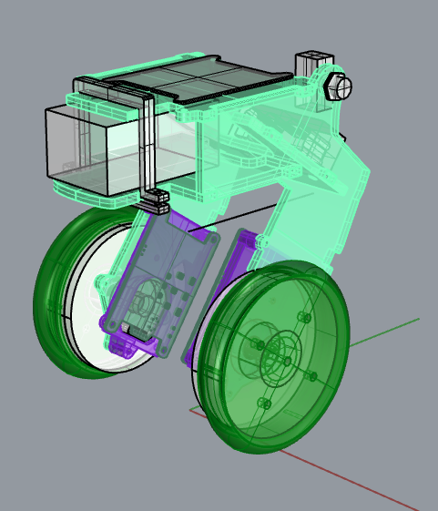
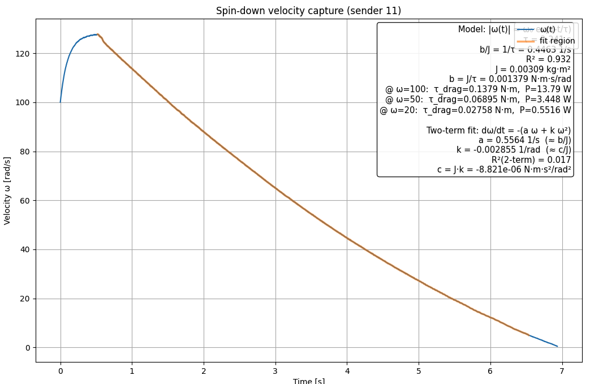
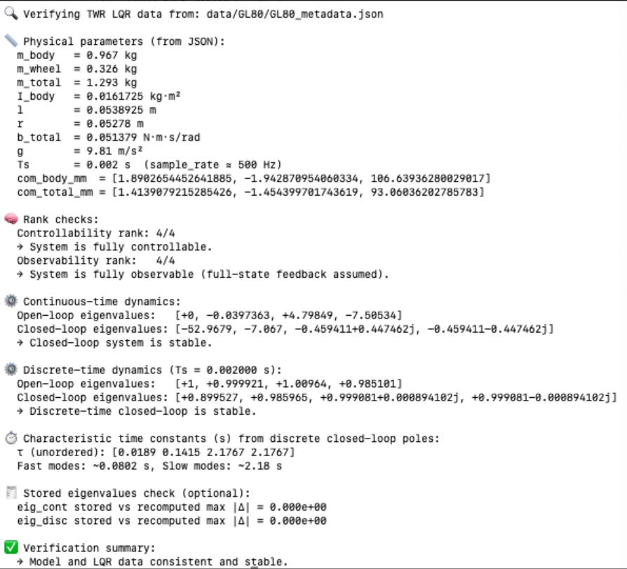
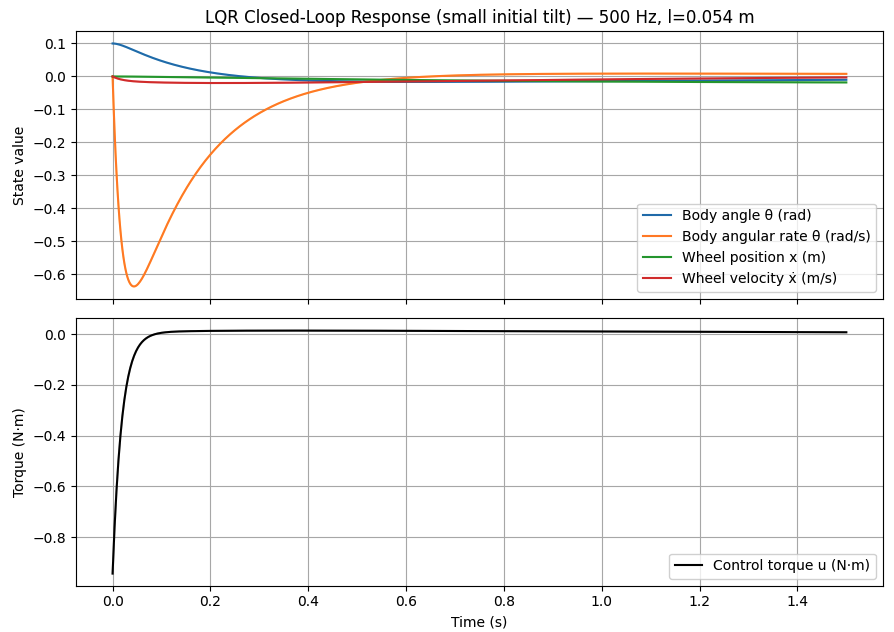

# Pendulum State-space Model Generation and Validation

## GOAL: Develop a final workflow for determining the gains to run a two wheel robot (TWR)

The intention here is to create a reproducible workflow for generating and validating the balancing robot model and LQR controller gains. Physical parameters are derived from CAD STL geometry and measured part masses, then automatically converted to SI units and used to compute CoM, inertia, and the linearized state-space model.

Model correctness is verified through automated checks including controllability/observability rank, continuous and discrete closed-loop pole analysis, time-constant estimation, and time-domain closed-loop simulation with actuator effort plots. This validation pipeline ensures the controller gains are consistent with the modeled physics before deployment to hardware.

## Steps to model validation
- Design your model in CAD 
- Export each stl part individually
- Consistency:
  - the global coordinate system for all STLs should be the same
  - the scripts assume the bot is sitting on the ground plane
  - units for STL parts are grams and millimeters
- Carefully weigh each part and record
- Generate data/GL80/GL80_parts.json
  - describe values that are used in this json [like this](data/GL80/GL80_params.json)
  - record other values (stl files, origin, axis of rotation)  

My current bot in CAD:



## Robot design tips
(future plan: break this out into a separate document)

- For most cases with a balancer, the motor is mounted on the bot
  - A portion of the motor is serving as the wheels (rotor)
  - Another portion is stationary (stator)
  - For the CoM calculations you'll need to figure out the masses of those parts
- Mount the imu over the axle
- The IMU should be placed away from the axis of rotation
- Vibration isolation is a huge issue [see here](../teensy40/vibration_testing/README.md) and [here](..//teensy40/mpu6050_spec.md)

## General workflow

```plaintext
$ ./spin_decay.py /dev/cu.usbmodem181813701 --J 0.00309
   ↓
   └── compute damping coefficient (b_Nm_s_per_rad)
   ↓

$ ./apps/generate_LQR_data.py -i data/GL80/GL80_params.json 
   ↓
   ├── computes mass, CoM, inertia
   └── writes JSON GL80_metadata.json
   ↓
$ ./verify_TWR_data.py LQR_bot_data.json
   ↓
   └── sanity checks lots of values
   ↓
View results: 
   ↓
   └── ./plot_TWR_response.py LQR_bot_data.json 
```

**NOTE:** I strongly recommend that you review each of the steps with ChatGPT. Show it the code and describe what you are doing, chat can play a role of lab partner and explain the purpose of each step. 


These are useful prompts for ChatG:
- What is your interpretation of these eigen values?
- Tell me about how total damping was calculated
- How did you arrive at the conclusion that the model and LQR data consistent and stable?
- Lets reality check my COM CoM 
- Lets reality check Moment of inertia
- How do all of my results compare to other 1.5kg sized balancing bots?
- What do you mean by "Q/R tradeoff"? 


## Motor / flywheel inertia calculation 

One part of modeling is calculating the damping coefficient of the motor `b_Nm_s_per_rad`, the rotational viscous damping coefficient. It models torque loss proportional to angular velocity: `𝜏_loss = 𝑏𝜔`

It is needed to:
- Correctly capture energy dissipation in the motor + drivetrain
- Place realistic damping terms in the state-space model
- Prevent overly aggressive or unstable LQR gains
- Get the simulation and real hardware to match.

Set up value:
- Load ../teensy40/can_posvel_on to the teensy
- This is the rig I used: [LINK](PICS/rig1.png)
- Spun with a cordless drill
- Flywheel treated as a solid flat disk
- Phase wires on motor were not connected to ESC
- Measured mass: 𝑀 = 429g = 0.429 kg
- Measured diameter: 240 mm → radius
- 𝑅 = 0.12 m
- For a solid disk about its central axis:
  - 𝐽 = 1/2 ⋅ M ⋅ R²

Substitute in mass:
- 𝐽 = 1/2 ⋅ 0.429 (0.12)² ≈ 0.00309 kg ⋅ m²
- This J was used to convert the measured spin-down time constant b=J/τ
- Run this command: `$ ./apps/spin_decay.py /dev/cu.usbmodem181813701 --J 0.00309`

**Result:**   


From the plot text:
- τ = 2.246 s (since 𝑏/𝐽 = 0.4463)
- R² = 0.932 → solid fit for real hardware
- J = 0.00309 kg·m² (flywheel)

Therefore:  

𝑏 =  𝐽 / 𝜏_time = 0.00309/ 2.246 = =0.00138 N⋅m⋅s/rad

The identified viscous damping coefficient represents the linearized low-speed loss of the motor–flywheel system under open-circuit conditions. Quadratic (aerodynamic) losses are present but intentionally excluded for LQR linear modeling.

ChatG says this is exactly the right order of magnitude for:
- A 300 g BLDC
- Decent bearings
- Moderate windage
- Open-circuit (not connected to ESC)


## Review of TWR data

Run: ```./apps/generate_LQR_data.py -i data/GL80/GL80_params.json ```

The program reads the STL assembly and per-part masses to compute the robot’s total mass, body and total centers of mass, and body moment of inertia, then builds the linearized continuous and discrete state-space models of the balancing robot about the wheel axle. It then computes the continuous and discrete LQR gains and reports the closed-loop eigenvalues to verify stability and dynamic behavior.

The program computes the closed-loop eigenvalues of the system using the LQR gains for both the continuous and discretized state-space models. These eigenvalues indicate whether the controller stabilizes the robot and show how fast each dynamic mode decays or oscillates. Continuous eigenvalues must have negative real parts and discrete eigenvalues must lie inside the unit circle for the balance controller to be stable.

```plaintext  
    "params": {
	"b_Nm_s_per_rad": 0.001379,
	"friction_term": 0.05,
	"wheel_radius": 52.78,
	"axle_origin": [0.0, 0.0, 52.78],
	"axle_vector": [0.0, 1.0, 0.0],
	"input_path": "/Users/owhite/MESC_brain_board/modeling/data/GL80",
	"output_file_name": "GL80_LQR_params.json"
    }
```

Review all these values
| Parameter          | Units    | Interpretation                       |
| ------------- | -------- | ------------------------------------ |
| com_total_mm  | mm       | consistent with 13 cm above ground   |
| com_body_mm   | mm       | ideal for stable LQR tuning          |
| m_total       | kg       | consistent with geometry and inertia |


**1. Continuous-time eigenvalues**
```
  "eig_cont": [
    [
      -52.967859199698964,
      0.0
    ],
    [
      -7.067002375469126,
      0.0
    ],
    [
      -0.45941090750909785,
      0.44746221761027616
    ],
    [
      -0.45941090750909785,
      -0.44746221761027616
    ]
  ],
```

**Interpretation**

Verifying the system poles (eigenvalues) confirms that the modeled dynamics and computed controller gains **actually produce a stable closed-loop system with the expected response speeds and damping**. It provides a direct, quantitative check that the LQR design, numerical implementation, and exported model data are internally consistent before deploying the controller to hardware.

ChatG is REALLY good at interpretting the eigen values. I have developed gains for two bots and they were different in behavior, but it has useful things to say about both sets. In this current case:

- The eigenvalues include a complex conjugate pair (nonzero imaginary parts), which means the closed-loop system is stable but underdamped — it will exhibit decaying oscillatory modes rather than purely monotonic decay. Stability requires negative real parts (continuous) or magnitudes < 1 (discrete), not that all eigenvalues be purely real.
- For a balancing robot with LQR, having a complex conjugate pole pair just means one mode is underdamped — you’ll get a small, decaying oscillatory component in the response rather than purely exponential (non-oscillatory) decay. 
- What is important is:
  - continuous poles have negative real part, and
  - discrete poles have magnitude < 1, and these do. 


|Mode         | Eigenvalue Time constant τ = –1/λ  | Interpretation
| ----------- | ---------------------------------- | ------------------------------------ |
|1–2 ≈ –1.14  | ≈ 0.88 s                           |Fast stabilization modes (angle and angular rate regulation).
|3–4 ≈ –0.053 | ≈  19 s	                           | Very slow modes (wheel position drift, integral-like effect).

So, physically:

- The LQR is actively damping the body angle and angular velocity quickly (under 1 second response time).
- The cart position / wheel drift is only weakly stabilized — it will slowly creep but remain bounded.
- That’s exactly what you expect for a torque-controlled balancing robot with standard LQR weights: prioritize angle balance, tolerate slow translation.

**2. Discrete-time eigenvalues**
```
  "eig_disc": [
    [
      0.8995269476247606,
      0.0
    ],
    [
      0.9859653460432849,
      0.0
    ],
    [
      0.9990812001385199,
      0.0008941024634992121
    ],
    [
      0.9990812001385199,
      -0.0008941024634992121
    ]
  ],
```

**Interpretation**

- These correspond to a discrete-time system at 500 Hz (Ts = 0.002 s).
- All values are less than 1, so the system is discretely stable.
- 0.8995 → fast decay, about 19 ms time constant (very quickly dies out).
- 0.9860 → slower decay, about 0.14 s time constant.
- The last two form a complex conjugate pair, so that mode is oscillatory but decaying 

|eig     | λ_cont (approx) | τ = –1/λ
| ------ | --------------- | --------
| 0.89953 | –52.97 s⁻¹ | 0.0189 s |
| 0.98597 | –7.07 s⁻¹ | 0.142 s |
| 0.99908 ± j… | –0.459 s⁻¹ | 2.18 s |


----

Run: ```$ ./apps/verify_LQR_data.py data/GL80/GL80_metadata.json ```

Results:



Make a screen shot of your output, show it to brother G, and ask for an interpretation of the data it sees

----

Run: ```$ ./apps/plot_TWR_response.py data/GL80/GL80_metadata.json ```

Check system dynamics and actuator demand by giving it some negative torque at then plot a smooth exponential decay toward zero as the robot rebalances.



Comments:

- Units (e.g., mm → m, g → kg) and inertia scaling are probably correct.
   - If they were off the smooth decay either be a sluggish drift or a chaotic oscillation.
- 𝑄 and  𝑅 weights are balanced to keep torque effort reasonable, and not over-penalize wheel displacement.
- Mechanical and electrical damping are promising

The bottom plot shows
- Large initial corrective torque
- Rapid decay toward ~0
- No chatter
- No sustained bias
- No oscillatory control effort

That implies:
- No hidden unstable mode
- No sign error in B or K
- No unit blow-up in inertia or lever arm
- Reasonable Q/R tradeoff

If something were wrong, this plot would usually show:
- Repeated torque sign flips
- Growing amplitude
- Saturation-scale commands
- Slow nonzero bias

The simulated closed-loop step response shows bounded control effort and monotonic state decay consistent with the computed closed-loop poles and time constants.

This is validation that the gains **_for the model of the robot_** are probably okay. It's all great but _on balance_ (pun intended) this does **NOT** mean the gains when applied physical robot is going to behave as well, but you cant expect your model to work without these values behaving properly. 
