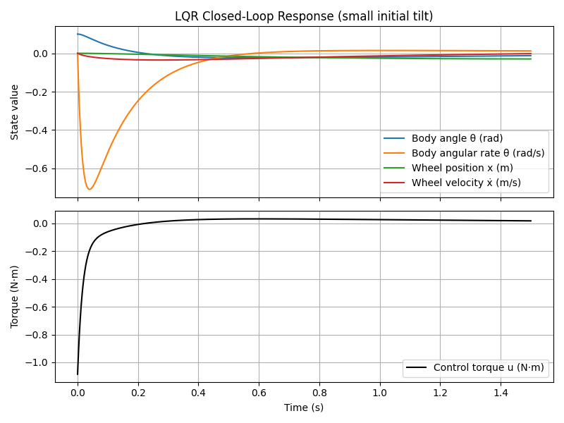

# Pendulum State-space Model Generation and Validation

## GOALS

- develop a final workflow for determining the gains to run a two wheel robot (TWR)
- properly handle directory structures for apps, CAD files, and data files

## Steps

- Design your model in CAD 
- Export each stl part individually
- At first I tried to do export with scripts in Rhino, but that kind of sucked. 
- Export is not rate-limiting so just did it by hand
- Generate data/GL80/GL80_parts.json
  - describe values that are used in this json
  - (stl files, origin, axis of rotation)  
  - 

## Design tips

- In some cases the motor is mounted on the bot
- A portion of the motor is serving as the wheels
- Another portion is stationary
- For the CoM calculations you'll need to separate those weights
- Other tips
  - mount the imu over the axle
  - the IMU should be placed away from the axis of rotation
  - vibration isolation is a huge issue [see here](../teensy40/vibration_testing/README.md) and [here](..//teensy40/mpu6050_spec.md) 
  - 
  
```plaintext  
{
  "params": {
    "b_Nm_s_per_rad": 0.09015231367088877,
    "friction_term": 0.05,
    "wheel_radius": 40
  }
}
```


## General workflow

Note: 

```plaintext
$ ./generate_TWR_data.py -i LQR_bot_metadata.json -r robot_params.json
   ↓
   ├── computes mass, CoM, inertia
   └── writes JSON LQR_bot_LQR_data.json
   ↓
$ ./verify_TWR_data.py LQR_bot_LQR_data.json
   ↓
   └── sanity checks lots of values
   ↓
View results: 
   ↓
   ├── ./plot_TWR_response.py LQR_bot_data.json 
   └── ./graph_LQR_data.py     pendulum_LQR_data.json 
   └── ./graph_angle_torque.py pendulum_LQR_data.json 
```

## Review of TWR data

These are useful prompts for ChatG:
- What is your interpretation of these eigen values?
- Tell me about how total damping was calculated
- How did you arrive at the conclusion that the model and LQR data consistent and stable?
- Reality check this value: Moment inertia I_b = 1.1758e-02 kg·m²
- Reality check my COM CoM (mm) = [-2.46032006e-02 -1.14117663e+01 1.30614191e+02]
- How do all of my results compare to other 1.5kg sized balancing bots

| Parameter          | Value    | Interpretation                       |
| ------------------ | -------- | ------------------------------------ |
| COM height (Z)     | 130.6 mm | consistent with 13 cm above ground   |
| COM above axle     | 90.6 mm  | ideal for stable LQR tuning          |
| Lateral offset (Y) | −11 mm   | reasonable asymmetry                 |
| Axial offset (X)   | ~0 mm    | symmetric about midplane             |
| Derived mass       | 1.4 kg   | consistent with geometry and inertia |

**1. Continuous-time eigenvalues**
```
eig_cont = [
  -1.1401778985598954,
  -1.1401778985598954,
  -0.05262332464223693,
  -0.053248906264029436
]
```

**Interpretation**

- All eigenvalues are real and negative, meaning the closed-loop system is stable (no oscillation, no complex conjugate pairs).
- There are two fast modes near –1.14 s⁻¹ and two slow modes near –0.053 s⁻¹.

|Mode         | Eigenvalue Time constant τ = –1/λ  | Interpretation
| ----------- | ---------------------------------- | ------------------------------------ |
|1–2 ≈ –1.14  | ≈ 0.88 s                           |Fast stabilization modes (angle and angular rate regulation).
|3–4 ≈ –0.053 | ≈  19 s	                           | Very slow modes (wheel position drift, integral-like effect).

So, physically:

- The LQR is actively damping the body angle and angular velocity quickly (under 1 second response time).
- The cart position / wheel drift is only weakly stabilized — it will slowly creep but remain bounded.
- That’s exactly what you expect for a torque-controlled balancing robot with standard LQR weights: prioritize angle balance, tolerate slow translation.

**2. Discrete-time eigenvalues**
```
eig_disc = [
  0.9977201969697364,
  0.9977201969697364,
  0.9998947593913394,
  0.9998935079390716
]
```

**Interpretation**
- These correspond to a discrete-time system at 500 Hz (Ts = 0.002 s).
- All values are less than 1, so the system is discretely stable.
- You can convert them to approximate continuous decay rates and if you do that:

|eig     | λ_cont (approx) | τ = –1/λ
| ------ | --------------- | --------
|0.99772 | –1.14 s⁻¹       | 0.88 s
|0.99989 | –0.053 s⁻¹      | 19 s

- The LQR successfully stabilizes your system: all modes decay, none oscillate.
- Two modes decay relatively quickly → you’ll see the body angle settle in ~1 s.
- Two modes decay very slowly → you’ll notice the bot can still drift forward/backward slowly over tens of seconds if you don’t include position feedback or integral correction.
- If you increased the Q weight on the position state, those slow eigenvalues would move further left (faster correction, less drift).

```
$ ./verify_TWR_data.py LQR_bot_LQR_data.json
```

|📏 Dimensions           |              |
| ---------------------- | ------------ |
| Body mass (kg):        | 0.6000       |
| Wheel mass (kg):       | 0.7600       |
| Inertia (kg·m²):       | 6.217621e+02 |
| Lever arm l (m):       | 0.0906       |
| Wheel radius r (m):    | 0.0400       |
| Damping b (N·m·s/rad): | 0.1402       |
|  Gravity (m/s²):       | 9.810        |

🧮 **Controllability rank: 4/4**  
  → System is fully controllable.  

⚙  **Observability rank:   4/4**  
  → System is fully observable (full-state feedback assumed).  

⚙️  **Continuous-time dynamics:**  
  Open-loop eigenvalues: `[ 0. -0.10305  0.04398 -0.04421]`  
  Closed-loop eigenvalues: `[-1.14018+1.01253j -1.14018-1.01253j -0.05262+0.j -0.05325+0.j]`   
  → Closed-loop system is stable.

⚙️  **Discrete-time dynamics (Ts = 0.002000 s):**  
  Open-loop eigenvalues: `[1. 0.999794 1.000088 0.999912]`  
  Closed-loop eigenvalues: `[0.99772 +0.00202j 0.99772 -0.00202j 0.999895+0.j 0.999894+0.j]`  
  → Discrete-time closed-loop is stable.  

⏱️  **Characteristic time constants (s)**: `[0.877 0.877 18.78 19.003]`  
Fast modes: ~0.88 s, Slow modes: ~18.9 s  
  → Lever arm l = 0.0906 m appears physically reasonable.  

✅ **Verification summary:**  
 → Model and LQR data consistent and stable.  


----

```
$ ./plot_TWR_response.py LQR_bot_data.json 
```

Check system dynamics and actuator demand by giving it some negative torque at then plot a smooth exponential decay toward zero as the robot rebalances.



This is validation that the gains **_for the model of the robot_** are probably okay. 

- Units (e.g., mm → m, g → kg) and inertia scaling are probably correct.
- (If they were off the smooth decay either be a sluggish drift or a chaotic oscillation.)
- 𝑄 and  𝑅 weights are balanced to keep torque effort reasonable, and not over-penalize wheel displacement.
- Mechanical and electrical damping seems ok

This does **NOT** mean the gains when applied physical robot is going to behave as well. 
