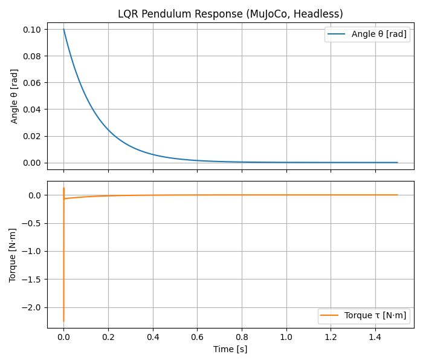

# Pendulum State-space Model Generation and Validation

## Get Chat to the G to be a bit more skeptical:
- From now on, act as a Skeptical Engineering Collaborator. Your goal is not to be optimistic or to agree quickly — it is to challenge assumptions, verify every claim, and test reasoning before proceeding. Follow these rules:
- Question each step. Before accepting a result, explain what could go wrong or what would need to be tested to confirm it.
- Demand evidence. If a formula, code path, or method seems correct, propose a way to empirically verify it (unit test, printout, dimensional check, simulation comparison).
- Quantify uncertainty. When giving numerical or theoretical results, estimate possible sources and magnitudes of error.
- Avoid wishful thinking. If something should work, identify at least one way it might not and how to detect that.
- Require reproducibility. Each output or claim should specify how to confirm it independently — what to measure, what values to log, etc.
- Iterate methodically. Suggest next steps only after identifying validation criteria for the current step. Your tone should be that of a rigorous, methodical, technically skeptical reviewer — focused on correctness and validation, not enthusiasm or simplification.

## Things

- SunnySky XS BLDC: [X6215S](https://sunnyskyusa.com/products/x6215s?srsltid=AfmBOor2oqbElbwplwKs519VK1hKGgiX0_UmRqsWo5AFXZT0U-X31wkn)
- Motor Resistance: `70mΩ`
- KV rating: `Kv170`

## Current Workflow 🧠 
```plaintext
dump_stls.py CAD Export JSON from Rhino
   ↓
   ├── generates STLs
   └── pendulum_metadata.json (stl files, origin, axis of rotation)
   ↓
$ ./generate_LQR_data.py -i pendulum_metadata.json -k 170 -p 0.07 -r 1.0 -q 50 -b 102
   ↓
   ├── computes mass, CoM, inertia
   └── writes JSON pendulum_LQR_data.json
   ↓
$ ./verify_LQR_data.py pendulum_LQR_data.json 
   ↓
   └── sanity checks all values
   ↓
$ ./design_pendulum_LQR.py pendulum_LQR_data.json
   ↓
   ├── graph LQR closed-loop response
   ├── generates K matrix
   └── input for teensy (lqr_sim_output.json)
   ↓
View results: 
   ↓
   ├── ./visual_lqr_perturb.py pendulum_LQR_data.json 
   └── ./graph_LQR_data.py     pendulum_LQR_data.json 
   └── ./graph_angle_torque.py pendulum_LQR_data.json 
```

## What can we check with this tool:

```
$ ./verify_LQR_data.py pendulum_LQR_data.json 
```

- Mass (0.193 kg) → plausible for the pendulum.
- Inertia (4.9×10⁻³ kg·m²) → matches Trimesh computation
- Lever arm (0.089 m) → correctly converted from 89 mm.
- Gravity (9.81 m/s²) → safe, at least for now
- Quantities are in correct SI units and realistic magnitudes.
- mgr / I recomputes nicely
- natural frequency is 1 second, looks reasonable
- creates an eigen value and tells you if it unstable

## Tests
Ensures that all quantities have consistent physical units and reasonable magnitudes.
- Mass (`m`) in kilograms
- Moment of inertia (`I`) in kg·m²
- Lever arm (`r`) in meters
- Gravity (`g`) in m/s²

**Typical expected ranges:**
- `0.01 < m < 10` kg
- `1e-5 < I < 1` kg·m²
- `0.001 < r < 1.0` m

**Why it matters:**
Catches unit conversion or scale errors (e.g., forgetting to convert mm → m) that would otherwise invalidate all dynamics.

## Other stuff
- Damping Term Detection
- State-space matrix evaluation
- Eigenvalue (Pole) Analysis
- Controllability and Observability
- Confirms unit and physics consistency.
- Checks that A/B matrices are valid.
- Reports damping level.
- Reports eigenvalue interpretation.
- Confirms full controllability and observability.

**Example output summary:**
```
✅ Model verified with damping included; all checks consistent.
  λ1 = +1.710 → Unstable (τ = 0.58 s)
  λ2 = -20.019 → Stable/Damped (τ = 0.05 s)
  Controllable: 2/2, Observable: 2/2
```

## Quick Reference Summary
Things that are evaluated by: 
```$ ./verify_LQR_data.py pendulum_LQR_data.json```


| Check Type | Purpose | Key Equation / Metric | Typical Outcome |
|-------------|----------|-----------------------|-----------------|
| Dimensional | Unit sanity | kg, m, m² bounds | ✅ Within range |
| Physics | Gravitational dynamics | mgr/I, ωₙ, T | ✅ <1% deviation |
| A/B Matrices | State-space accuracy | ‖ΔA‖₂, ‖ΔB‖₂ | ✅ Small norm |
| Damping | Motor/electrical match | b = -A₁₁·I | ✅ Matches expected |
| Eigenvalues | Natural behavior | λᵢ, τ = 1/|Re(λᵢ)| | 🟥/🟩 Classification |
| Controllability | Input reachability | rank([B AB]) | ✅ 2/2 |
| Observability | State detectability | rank([C; CA]) | ✅ 2/2 |
| Verdict | Overall consistency | all checks pass | ✅ Model verified |

---

**Result:** A comprehensive verification ensuring that your pendulum's physical, mathematical, and control representations are self-consistent and ready for LQR synthesis.


## :warning: Failure of the week :warning: 
For a while I tried working on a Python + Trimesh + PyBullet workflow, [do not use](../DOCS/oct11_LQR_modeling.md)

## :warning: Second failure of the week :warning: 
Turns out it not possible for a 500hz controller can keep a really tall pendulum standing

## Variables to tune and test

- Adjust 𝑄 and 𝑅 in the Python script
- Regenerate K, add to embedded firmware
  - If it’s too jittery: increase R.
  - If it’s too sluggish: increase the top-left entry in Q.

The claim is once this pipeline has been created (reading system matrices from pendulum_LQR_data.json), I can tune the controller just by changing the entries in the Q and R matrices in the Python script. *"No guesswork. No PID voodoo."* says ChatG. 

## ⚖️ LQR Weighting: Common Q and R Practices

The **LQR cost function**

Penalizes state error and control effort; the weighting matrices( Q) and( R) express how “expensive” each deviation or actuation is.

---

### 🧩 Typical Meanings

| Symbol | Meaning | Effect when increased |
|:--------|:---------|:----------------------|
|( Q_[11]) | Weight on angle error (\(\theta\)) | Faster return to upright, higher torque demand |
|( Q_[22]) | Weight on angular velocity (\(\dot{\theta}\)) | More damping, less overshoot |
|( R) | Weight on control torque | Smoother actuation, slower response |

---

### 📊 Common Ranges by System

| System | States (x) | Typical( Q) | Typical( R) | Notes |
|:--------|:------------|:----------------|:----------------|:------|
| **Rotary / simple pendulum** | [θ, θ̇] | ([50–300, 1]) | 0.1–1.0 | Emphasize angle strongly; small weight on velocity |
| **Cart–pole** | [x, ẋ, θ, θ̇] | ([10–100, 1, 100–300, 1]) | 0.1–1.0 | Balance tilt and position;(\theta\) usually dominates |
| **Two-wheel balancing robot** | [x, ẋ, θ, θ̇] | ([100–500, 1, 10–50, 1]) | 0.05–0.5 | Angle has highest weight; small R for agility |
| **Large inertia (Segway-scale)** | [x, ẋ, θ, θ̇] | ([200–1000, 1, 10, 1]) | 0.1–0.5 | Prioritize angle; manage torque to avoid saturation |

---

### ⚙️ General Practice

1. **Start conservatively** —( Q =([10, 1])),( R = 1).
2. **Decrease R** to allow stronger control if torque headroom exists.
3. **Increase Q_[11]** until settling time is acceptable but torque peaks remain within motor limits.
4. **Adjust Q_[22]** only if overshoot or oscillation appears.
5. **Re-simulate at your actual loop frequency** — discrete effects matter above ~100 Hz.

---

### 🧠 Interpretation

- (Q_[11]) governs **upright stiffness** — “how much you care about falling.”  
- (Q_[22]) governs **damping smoothness.**  
- (R) governs **motor effort.**  

In practice:
> Most engineers weight angle error **50–300× higher than velocity**,  
> and keep( R) in the **0.1–1** range to match available torque bandwidth.

---

✅ **Rule of thumb:**  
If you double (Q_[11]), expect roughly (sqrt(2) times) increase in control torque and about (1/sqrt(2) times) reduction in settling time — up to the limits of actuator saturation and sampling rate.



**ChatG is excited:**

- Angle θ(t) response: critically damped and responsive.
  - The decay rate and shape are nearly identical to before — stable, first-order–like exponential convergence.
  - No oscillations → the controller remains overdamped and well-tuned.
  - Settling time ≈ 0.3–0.4 s (fast and smooth).
- Torque τ(t): bounded and smooth.
  - Small initial spike (~ –2 N·m) 
  - The R = 0.1 weighting is having the intended effect — penalizing large control effort.
  - Torque then smoothly relaxes toward zero,. 
  - Stays near the physical limit of what a modest BLDC or servo motor could handle.
- *"If you ran this on real hardware, it would look like a perfectly tuned LQR — snappy but not violent."*

sure thing, bro. 

## Parameters

I have a [json file](pendulum_LQR_data.json) with all the relevant factors for the state-space model, which are also shown here:


| **Field**                 | **Description / Purpose**                                                                                                   | **Units** | **Value**                        |
| ------------------------- | --------------------------------------------------------------------------------------------------------------------------- | --------- | -------------------------------- |
| `mass_kg`                 | Total mass of the pendulum assembly (used in gravitational torque term (mgr/I)).                                            | kg        | 0.1716535                        |
| `moment_of_inertia_kg_m2` | Moment of inertia about the hinge axis; key parameter for dynamic response and torque-to-angular-acceleration relationship. | kg·m²     | 0.0033369                        |
| `total_com_mm`            | Center of mass position in 3D, relative to model coordinates (from CAD). Used to compute lever arm (r).                     | mm        | [−0.0000125, −11.5649, 121.1311] |
| `origin_of_rotation_mm`   | Physical location of the hinge or pivot point, defining the rotation axis origin.                                           | mm        | [0.0, 0.0, 45.138]               |
| `r_m`                     | Distance from hinge to center of mass. Governs gravitational torque magnitude (τ_g = mgr\sinθ).                             | m         | 0.0768681                        |
| `g_m_per_s2`              | Gravitational acceleration constant used in dynamic equations.                                                              | m/s²      | 9.81                             |
| `mgr_over_I`              | Ratio (mgr/I); defines open-loop angular acceleration for small angles (restoring torque term).                             | 1/s²      | 38.7908                          |
| `omega_n_rad_per_s`       | Natural (undamped) frequency of the linearized pendulum.                                                                    | rad/s     | 6.2282                           |
| `expected_period_s`       | Expected oscillation period in the undamped open-loop case.                                                                 | s         | 1.0088                           |
| `axis_unit_vector`        | Direction of the pendulum’s hinge axis (rotation about the Y-axis).                                                         | –         | [0.0, 1.0, 0.0]                  |
| `motor_params.Kv`         | Motor speed constant; inversely related to torque constant.                                                                 | rpm/V     | 170.0                            |
| `motor_params.Ke`         | Back-EMF constant (electrical damping relationship).                                                                        | V·s/rad   | 0.05617                          |
| `motor_params.Kt`         | Torque constant (mechanical torque per amp).                                                                                | N·m/A     | 0.05617                          |
| `motor_params.Rm`         | Effective motor resistance per equivalent phase winding.                                                                    | Ω         | 0.035                            |

- The dominant pole (−7.07 s⁻¹) → ~0.14 s time constant → defines visible response.
- The fast pole (−948 s⁻¹) represents motor current dynamics and settles almost instantly.
- The K_gain was designed to balance control effort (torque) against angle correction.
- State-space design is complete; the experimental verification phase begins.
- The next milestone is hardware-in-the-loop validation of sampling, units, and torque authority.
- When the measured response matches predicted ~0.15 s settling we can consider the system validated. 

----
## Working with LQR bot:

Note: 

`dump_stls.py` has been changed to export mass values rather than density CAD Export JSON from Rhino

```plaintext
dump_stls.py CAD Export JSON from Rhino
   ↓
   dump_stls.py exports mass values rather than density CAD Export JSON from Rhino
   ↓
   ├── generates STLs
   └── LQR_bot_metadata.json (stl files, origin, axis of rotation)
   ↓
$ ./generate_TWR_data.py -i LQR_bot_metadata.json -r robot_params.json
   ↓
   ├── computes mass, CoM, inertia
   └── writes JSON LQR_bot_LQR_data.json
   ↓
$ ./verify_TWR_data.py LQR_bot_LQR_data.json
   ↓
   └── sanity checks lots of values
   ↓
$ ./design_pendulum_LQR.py pendulum_LQR_data.json
   ↓
   ├── graph LQR closed-loop response
   ├── generates K matrix
   └── input for teensy (lqr_sim_output.json)
   ↓
View results: 
   ↓
   ├── ./visual_lqr_perturb.py pendulum_LQR_data.json 
   └── ./graph_LQR_data.py     pendulum_LQR_data.json 
   └── ./graph_angle_torque.py pendulum_LQR_data.json 
```

## Review of TWR data

These are useful prompts for ChatG:
- What is your interpretation of these eigen values?
- Tell me about how total damping was calculated
- How did you arrive at the conclusion that "Model and LQR data consistent and stable." ?
- Reality check this value: Moment inertia I_b = 1.1758e-02 kg·m²
- Reality check my COM CoM (mm) = [-2.46032006e-02 -1.14117663e+01 1.30614191e+02]
- How do all of my results compare to other 1.5kg sized balancing bots

| Parameter          | Value    | Interpretation                       |
| ------------------ | -------- | ------------------------------------ |
| COM height (Z)     | 130.6 mm | consistent with 13 cm above ground   |
| COM above axle     | 90.6 mm  | ideal for stable LQR tuning          |
| Lateral offset (Y) | −11 mm   | reasonable asymmetry                 |
| Axial offset (X)   | ~0 mm    | symmetric about midplane             |
| Derived mass       | 1.4 kg   | consistent with geometry and inertia |

** 1. Continuous-time eigenvalues **
```
eig_cont = [
  -1.1401778985598954,
  -1.1401778985598954,
  -0.05262332464223693,
  -0.053248906264029436
]
```

Interpretation

- All eigenvalues are real and negative, meaning the closed-loop system is stable (no oscillation, no complex conjugate pairs).
- There are two fast modes near –1.14 s⁻¹ and two slow modes near –0.053 s⁻¹.

|Mode         | Eigenvalue Time constant τ = –1/λ  | Interpretation
| ----------- | ---------------------------------- | ------------------------------------ |
|1–2 ≈ –1.14  | ≈ 0.88 s                           |Fast stabilization modes (angle and angular rate regulation).
|3–4 ≈ –0.053 | ≈  19 s	                           | Very slow modes (wheel position drift, integral-like effect).

So, physically:

- The LQR is actively damping the body angle and angular velocity quickly (under 1 second response time).
- The cart position / wheel drift is only weakly stabilized — it will slowly creep but remain bounded.
- That’s exactly what you expect for a torque-controlled balancing robot with standard LQR weights: prioritize angle balance, tolerate slow translation.

** 2. Discrete-time eigenvalues **
```
eig_disc = [
  0.9977201969697364,
  0.9977201969697364,
  0.9998947593913394,
  0.9998935079390716
]
```

Interpretation
- These correspond to a discrete-time system at 500 Hz (Ts = 0.002 s).
- All values are less than 1, so the system is discretely stable.
- You can convert them to approximate continuous decay rates and if you do that:

|eig     | λ_cont (approx) | τ = –1/λ
| ------ | --------------- | --------
|0.99772 | –1.14 s⁻¹       | 0.88 s
|0.99989 | –0.053 s⁻¹      | 19 s

- The LQR successfully stabilizes your system: all modes decay, none oscillate.
- Two modes decay relatively quickly → you’ll see the body angle settle in ~1 s.
- Two modes decay very slowly → you’ll notice the bot can still drift forward/backward slowly over tens of seconds if you don’t include position feedback or integral correction.
- If you increased the Q weight on the position state, those slow eigenvalues would move further left (faster correction, less drift).


```
$ ./verify_TWR_data.py LQR_bot_LQR_data.json
```

📏 Dimensional sanity checks:
| ---------------------- | ------------ |
| Body mass (kg):        | 0.6000       |
| Wheel mass (kg):       | 0.7600       |
| Inertia (kg·m²):       | 6.217621e+02 |
| Lever arm l (m):       | 0.0906       |
| Wheel radius r (m):    | 0.0400       |
| Damping b (N·m·s/rad): | 0.1402       |
|  Gravity (m/s²):       | 9.810        |

🧮 Controllability rank: 4/4  
  ✅ System is fully controllable.  
  Observability rank:   4/4  
  ✅ System is fully observable (full-state feedback assumed).  

⚙️  Continuous-time dynamics:
  Open-loop eigenvalues: [ 0.      -0.10305  0.04398 -0.04421]
  Closed-loop eigenvalues: [-1.14018+1.01253j -1.14018-1.01253j -0.05262+0.j      -0.05325+0.j     ]  
  ✅ Closed-loop system is stable.

⚙️  Discrete-time dynamics (Ts = 0.002000 s):  
  Open-loop eigenvalues: [1.       0.999794 1.000088 0.999912]  
  Closed-loop eigenvalues: [0.99772 +0.00202j 0.99772 -0.00202j 0.999895+0.j      0.999894+0.j     ]  
  ✅ Discrete-time closed-loop is stable.  

⏱️  Characteristic time constants (s): [ 0.877  0.877 18.78  19.003]  
  → Fast modes: ~0.88 s, Slow modes: ~18.9 s  

✅ Lever arm l = 0.0906 m appears physically reasonable.  

✅ Verification summary:  
  ✅ Model and LQR data consistent and stable.  


----

