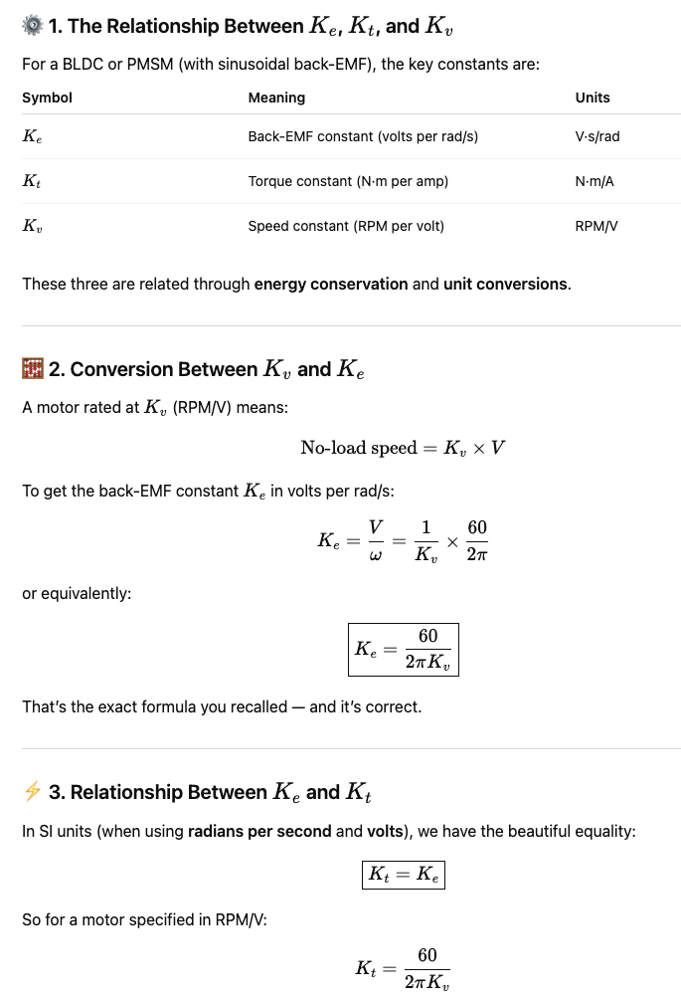
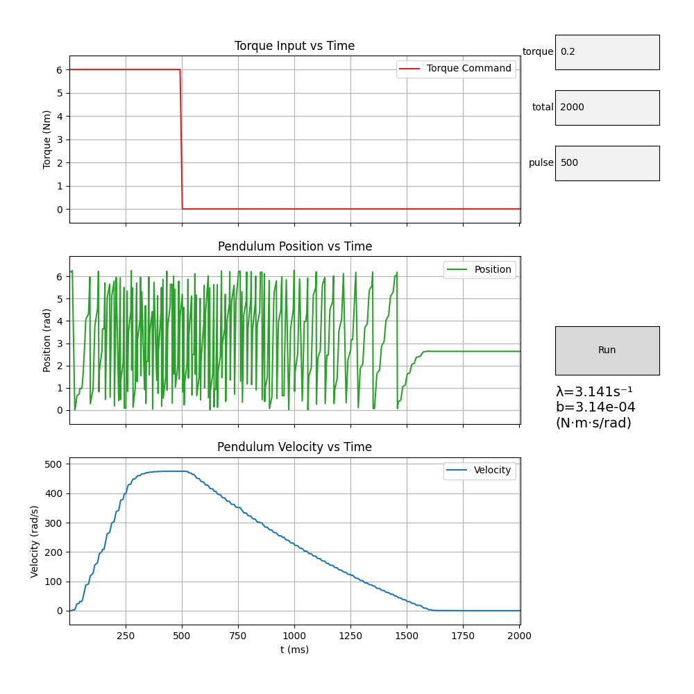
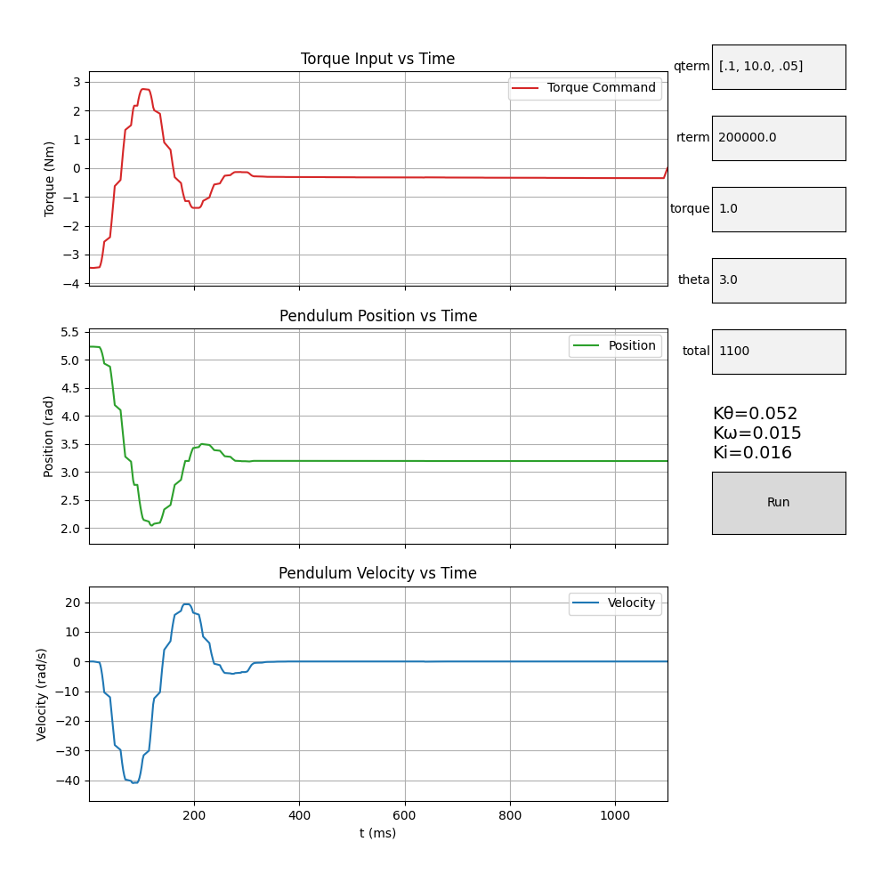

# LQI ≡ Linear–Quadratic–Integral 

## Goals

This document describes the workflow for running LQI

- Gather up motor constants Ke, Kt, Kv
- Plot motor decay constant
- Develop LQI model
- Tune

## Motor Constants Ke, Kt, Kv



## Motor Constants: motor decay

After applying a known torque pulse to the motor, the control program records the motor’s angular velocity as it freely spins down once the torque command is set to zero. During this free-decay phase, no active control or regenerative braking is applied—the motion is governed solely by passive damping effects such as bearing friction, air drag, and internal electrical losses.

The motor’s deceleration follows the first-order dynamic model:

𝐽𝜔˙ + 𝑏 = 0

whose analytical solution is:

𝜔(𝑡) = 𝜔0𝑒 <sup>−(𝑏/𝐽)𝑡</sup>

Taking the natural logarithm of velocity gives a linear relationship:

ln(𝜔) = ln(𝜔0) − 𝜆𝑡

where the slope 𝜆 = 𝑏 / 𝐽 is the decay constant.

The program automatically identifies the point where torque drops to zero and fits a straight line to the logarithm of the velocity data in the decay region. From this, it computes:

- Decay constant: 𝜆 = 𝑏 / 𝐽
- Damping coefficient: 𝑏 = 𝜆 𝐽 (if the inertia is known or estimated)

These values are displayed in the GUI label and provide a direct, repeatable way to quantify mechanical damping in the system. The estimated damping coefficient 𝑏 is used later in the control model to refine LQR/LQI design and improve accuracy in simulated or analytical predictions.

## Python Interface

Launch the graphing program

```
$ ./LQI_experiment.py -p /dev/cu.usbmodem178888901 -j pulse.json
```

json command passed to teensy:
``` {'cmd': 'send', 'pulse_torque': 0.4, 'total_us': 2000000, 'pulse_us': 500000}```

This spins the **bare** motor (no pendululum and gives this result: 



Estimated decay constant 
- `λ = 3.1526 s⁻¹` 
- `b=3.15e-04`

## Modeling 

We have a bunch of variables, let's go:


Parameters that need to be chosen

| Parameter             | Description                           | Typical Starting Point                                                      |
| --------------------- | ------------------------------------- | --------------------------------------------------------------------------- |
| (Q)                   | State weighting matrix                | [𝑄𝜃, 𝑄𝜔, 𝑄𝑖] — emphasize position & integral more than velocity       |
| (R)                   | Control effort weight                 | scalar; start around 0.1–10 depending on how aggressive you want torque use |
| sampling period (T_s) | Discretization step (for Teensy loop) | 1–2 ms (≈ 500–1000 Hz outer loop)                                           |
| actuator limits       | torque or current saturation          | ± Kₜ · Iₘₐₓ, e.g. ± 1.68 N·m for 30 A                                       |

Once 𝑄, 𝑅 are computed, this enables you to move variables on to the teensy for:  
**𝐾 = [𝐾𝜃, 𝐾𝜃˙,𝐾𝑖]**

## Position control

The inputs are passed as json on parameters, and will include:
Kt = 0.005617 Nm, λ = 3.1526 s⁻¹ , b=3.15e-04 and Ts = 0.002

they will be passed in this way: 

```
{
  "qterm": "[.1, 10.0, .05]",
  "rterm": 200000.0,
  "Kt": 0.005617,
  "lambda": 3.1526,
  "Ts": 0.002,
  "b_decay": 0.000315,
  "torque": 1.0,
  "theta": 3.0,
  "total_ms": 1100,
  "LQI_path": "/Users/owhite/MESC_brain_board/teensy40/LQI_experiment"
}
```
These data are used by the python program:

```
$ ./LQI_command.py -p /dev/cu.usbmodem178888901 -j params.json
```

which outputs the data to the teensy through the serial

```
{'cmd': 'position', 'torque': 1.0, 'total_us': 1100000, 'user_Kth_term': 0.0523, 'user_Kw_term': 0.0147, 'user_Ki_term': 0.0158, 'theta_ref': 3.0}
```

The teensy uses these K-gains in the following code:

```c
void run_mode_set_position(Supervisor_typedef *sup,
                           FlexCAN_T4<CAN1, RX_SIZE_256, TX_SIZE_16> &can) {
    if (!sup->esc[0].state.alive) { return; }

    static bool first_entry = true;
    static unsigned long start_time = 0;

    // ---------------- Control parameters ----------------
    const float TORQUE_CLAMP = 0.6f;

    float torque       = (sup->user_torque != 0)   ? sup->user_torque   : 0.0f;
    float Kth_term     = (sup->user_Kth_term != 0) ? sup->user_Kth_term : 0.0f;
    float Kw_term      = (sup->user_Kw_term != 0)  ? sup->user_Kw_term  : 0.0f;
    float Ki_term      = (sup->user_Ki_term != 0)  ? sup->user_Ki_term  : 0.0f;
    uint32_t total_us  = (sup->user_total_us != 0) ? sup->user_total_us : 0;

    // ---------------- Initialize  ----------------
    if (first_entry) {
        logIndex = 0;
        first_entry = false;
        start_time = micros();

	Serial.printf("{\"cmd\":\"PRINT\",\"note\":\"%s\", \"torque\":%.3f, \"Kth\":%.3f, \"Kw\":%.3f, \"Ki\":%.3f, \"total_us\":%lu}\n", 
	      "LQI set position started",
		      torque,
		      Kth_term,
		      Kw_term,
		      Ki_term,
		      total_us
		      );

    }

    // Timing
    unsigned long now_time = micros();
    unsigned long elapsed  = now_time - start_time;

    // static variables preserve integral state across calls
    static float integ_error = 0.0f;
    float torque_cmd = 0.0f;

    // Get current feedback
    float theta = sup->esc[0].state.pos_rad;
    float omega = sup->esc[0].state.vel_rad_s;
    float theta_ref = sup->user_theta;   // radians position

    // Compute position error
    //   this controls the sign/direction of motor
    float error = theta_ref - theta;

    // Integrate error over time
    float dt = 0.002f; // 2 ms control period
    integ_error += error * dt;
    integ_error = constrain(integ_error, -0.1f, 0.1f);

    // Reduce the velocity damping term by an order of magnitude
    //   matching the true mechanical damping of the motor
    Kw_term *= 0.1f;

    // Control law
    torque_cmd = Kth_term * error - Kw_term * omega + Ki_term * integ_error;

    // Clamp to safe limits
    if (torque_cmd > TORQUE_CLAMP)  torque_cmd = TORQUE_CLAMP;
    if (torque_cmd < -TORQUE_CLAMP) torque_cmd = -TORQUE_CLAMP;

    // Total_us elapsed, shut off
    if (elapsed >= total_us) {
      torque_cmd = 0.0f;
    }

    // Send torque over CAN
    CAN_message_t msg;
    msg.id = canMakeExtId(CAN_ID_IQREQ, TEENSY_NODE_ID,
                          sup->esc[0].config.node_id);
    msg.len = 8;
    msg.flags.extended = 1;
    canPackFloat(torque_cmd, msg.buf);
    canPackFloat(0.0f, msg.buf + 4);
    can.write(msg);

    // Log 
    if (logIndex < LOGLEN) {
      logBuffer[logIndex++] = {
	elapsed,
	torque_cmd,
	sup->esc[0].state.pos_rad,
	sup->esc[0].state.vel_rad_s
      };
    }

    // End condition, dump the json log
    if (elapsed >= total_us) {
      Serial.println("{ \"samples\":[");
      for (int i = 0; i < logIndex; i++) {
        Serial.printf("{\"t\":%lu,\"torque\":%.4f,\"pos\":%.4f,\"vel\":%.4f}%s\r\n",
                      logBuffer[i].t_us,
                      logBuffer[i].torque,
                      logBuffer[i].pos,
                      logBuffer[i].vel,
                      (i < logIndex - 1) ? "," : "");
      }
      Serial.println("]}\r\n");

      sup->mode = SUP_MODE_IDLE;
      first_entry = true;
    }

    sup->esc[0].state.alive = false;
}
```

## Tuning 

The UI for the python graphing progam enables user input for the Matrix Q, R term and other variables. Adjusting each term has these impacts

| Parameter              | Symbol     | Effect on Behavior          | What You’ll See                                                              |
| ---------------------- | ---- | --------------------------- | ---------------------------------------------------------------------------- |
| **Position weight**   | 𝑄𝜃 | Penalizes position error    | Higher → faster response, more torque, can overshoot                         |
| **Velocity weight**   | 𝑄𝜔 | Penalizes angular speed     | Higher → smoother motion, less oscillation, slower response                  |
| **Integrator weight** | 𝑄𝑖  | Penalizes accumulated error | Higher → removes steady-state bias faster, but can cause bounce or overshoot |
| **Torque weight**     | 𝑅  | Penalizes torque effort     | Higher → gentle, slower motion; Lower → aggressive, fast, more power draw    |


🟢 Increase 𝑄𝜃
- Controller fights harder to correct position.
- Quicker movement toward target.
- More torque, possibly overshoot or oscillation.
- Good for: precision pointing or small loads.
- Bad for: high inertia or torque saturation limits.

🟣 Increase 𝑄𝜔
- Penalizes velocity — adds damping.
- Reduces overshoot and bounce.
- Too high: motion becomes sluggish, stalls before setpoint.
- Good for: stability and smoothness.

🟠 Increase 𝑄𝑖
- Stronger correction for small residual errors.
- Improves accuracy; reduces steady-state offset.
- Too high: integral windup → small oscillations or “creep.”
- Good for: eliminating long-term bias in load torque.

🔵 Increase 𝑅
- Discourages large torque commands.
- Makes controller conservative and smooth.
- Too high: system becomes underpowered, never reaches setpoint.
- Good for: when you want to test safely or avoid current spikes.

🔴 Decrease 𝑅
- Controller becomes aggressive.
- Higher torque, faster rise time.
- Too low: possible overshoot or torque saturation.
- Good for: when you want more “authority” (stronger actuation).



