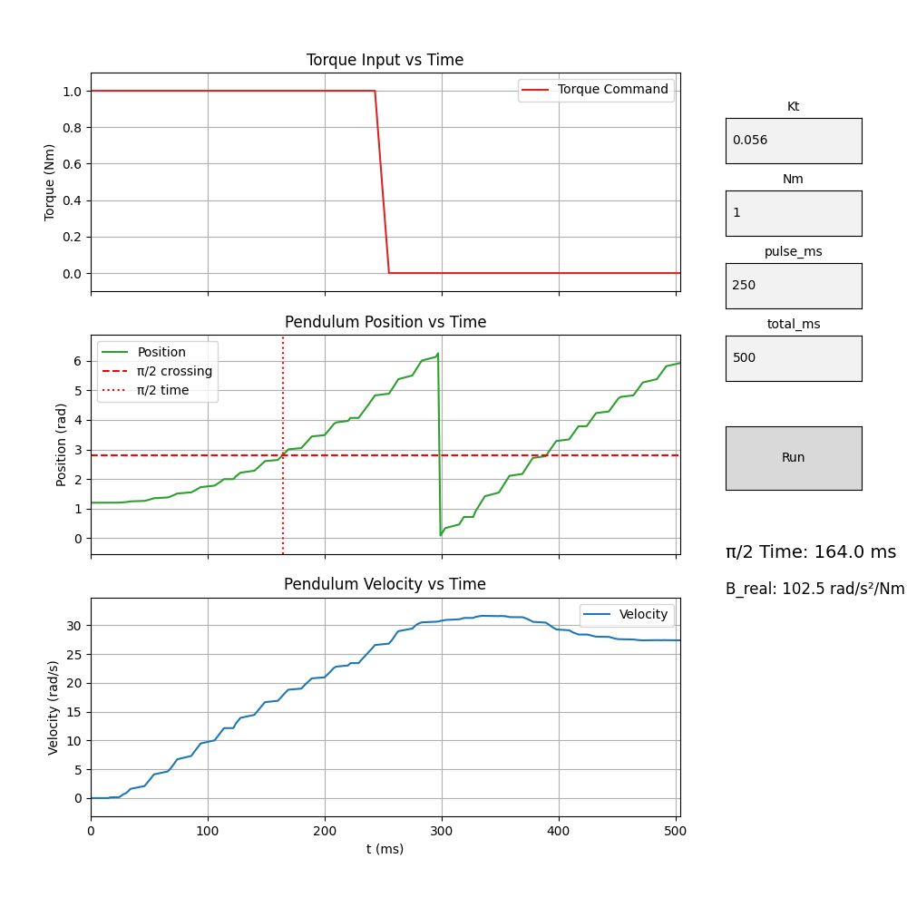

# Torque Response Experiments & System Identification

This document describes the workflow for running **pulse torque experiments** on the Teensy + MESC setup and comparing results to a physics-based model (PyBullet or analytical). It builds directly on the ideas in `sept30_least_squares.md`.

---

## Goals

- Apply known torque inputs (pulses) to the pendulum/motor system.  
- Measure **position** and **velocity** response over time.  
- Compare experimental response to **model predictions**.  
- Use **least squares** fitting to refine system parameters (e.g., inertia, damping, Kt).  

---

## Motor Constants

We start from the motor’s published specs:

- Kv = **170 RPM/V** (from datasheet)  
- Relationship between Kv and torque constant Kt:

\[
K_t = \frac{60}{2 \pi \cdot K_v}
\]

- For Kv = 170:

\[
K_t \approx 0.056 \, \text{Nm/A}
\]

This constant does **not depend on supply voltage** (30 V in our case). Voltage only sets no-load speed.  

---

## From Torque (Nm) to ESC Command

1. **Desired Torque** \(T\): e.g., 0.2 Nm.  
2. **Required Current**:

\[
I = \frac{T}{K_t} = \frac{0.2}{0.056} \approx 3.57 \, \text{A}
\]

3. **Normalized Command**:  
   The ESC torque command ranges from -1.0 to +1.0, where 1.0 corresponds to ±I_max.  
   If I_max = 30 A:

\[
\text{command} = \frac{I}{I_\text{max}} = \frac{3.57}{30} \approx 0.12
\]

✅ So a **command ≈ 0.12** corresponds to ~0.2 Nm torque.

---

## Teensy Supervisor Integration

We extended the **Supervisor_typedef** to hold user-configurable pulse parameters:

```cpp
float    user_pulse_torque   = 0.2f;    // normalized command [-1,1]
uint32_t user_pulse_us       = 85000;   // pulse duration (µs)
uint32_t user_total_us       = 170000;  // total duration (µs)
```

---

## Torque Response Mode

We replaced the old `run_mode_set_position()` with:

```cpp
void run_mode_torque_response(Supervisor_typedef *sup,
                              FlexCAN_T4<CAN1, RX_SIZE_256, TX_SIZE_16> &can);
```

Behavior:

1. On entry:
   - Reset timer and log buffer.  
2. For first `user_pulse_us` µs:
   - Send `user_pulse_torque` as normalized torque command over CAN.  
3. For remainder up to `user_total_us` µs:
   - Send `0.0f` torque command.  
4. At `user_total_us`:
   - Dump collected samples in JSON:
     ```json
     { "samples": [
       {"t":0, "torque":0.2, "pos":..., "vel":...},
       {"t":1000, "torque":0.2, "pos":..., "vel":...},
       ...
     ]}
     ```
   - Exit to `SUP_MODE_IDLE`.  

---

## Logging

Each sample records:

- `t_us` (µs since start of experiment)  
- `torque` (normalized ESC command)  
- `pos` (measured rotor angle, rad)  
- `vel` (measured rotor velocity, rad/s)  

These logs are consumed later in Python for least squares fitting.

---

## Python Interface

We will use a Python + matplotlib GUI to:

1. Accept user parameters:
   - `Kt` (Nm/A)  
   - `pulse_duration` (ms)  
   - `torque_request` (Nm)  
2. Compute:
   - Phase current: \(I = T / K_t\)  
   - Normalized command: \(I / I_\text{max}\)  
3. Send configuration (`user_pulse_torque`, `user_pulse_us`, `user_total_us`) to the Teensy over serial.  
4. Run the experiment.  
5. Retrieve JSON logs and overlay experimental response with PyBullet predictions.  

Launch the graphing program
```
$ ./torque_raise.py  /dev/cu.usbmodem178888901
```

---

## Modeling & Validation

- In PyBullet (or analytical model), simulate the pendulum response to the same pulse torque input.  
- Compare **position** and **velocity** traces to experimental data.  
- Apply **least squares fitting** to minimize error and update estimated parameters (inertia, damping, Kt).  
- Iterate until model matches physical system.  

---

## Modeling the B term applying to the physical plant. 


The standard state-space model for a pendulum is 𝑥-dot =Ax+Bu, where B represents how strongly the applied control input u (torque) affects the pendulum’s angular acceleration. To model 𝐵 accurately, we need to determine how much actual physical torque the motor produces for a given commanded torque value from the controller. In other words, we must measure the motor’s torque-per-command ratio — the mapping between the controller’s normalized input and the true torque applied at the pendulum joint.

- Run: `$ ./torque_raise.py /dev/cu.usbmodem178888901`
- The program computes acceleration: `np.gradient(vel, t)` numerically differentiates velocity.
- Estimated `B_real` = 102.5 rad/s² per N·m
- The results are:



