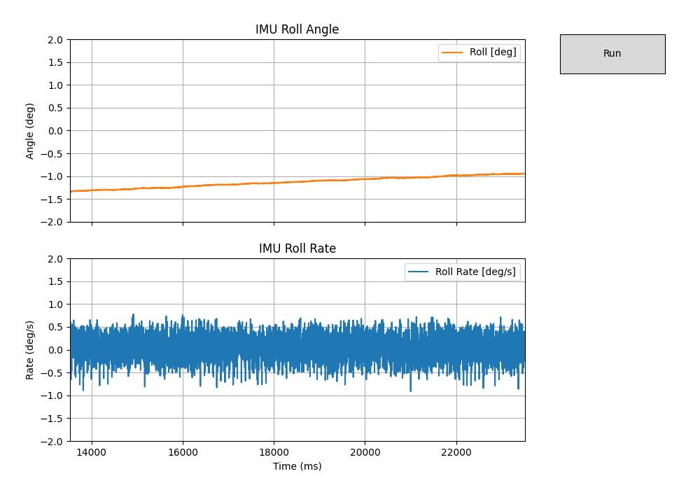

## MPU Testing

During bench testing of the Two-Wheeled Robot (TWR) control stack, the MPU6050 IMU exhibited significant vibration-induced noise when the motors were energized. The Teensy is executing the run_mode_balance_TWR() loop at 500 Hz, using IMU-derived roll and roll-rate feedback for the LQR controller.

When the motors are off, both signals are stable and near-DC, confirming correct sensor setup and minimal electrical noise. However, when the motors spin (with the robot frame fixed to a test board), the roll-rate signal shows ±1 deg/s jitter and small bias drift, indicating mechanical coupling of motor and chassis vibrations into the IMU.

```
$ ./IMU_test.py -p /dev/cu.usbmodem178888901
```


and this is with:



This test configuration is not fully representative of real operation—the PCB, IMU, and motors are rigidly mounted to a flat board rather than the full TWR body. Because the robot cannot balance yet, it is difficult to collect realistic motion data while the system is in its operational configuration.

The immediate objective is to characterize and mitigate the vibration coupling before full balancing tests. Planned steps include:
- Implementing on-sensor filtering (MPU6050 DLPF = 20–42 Hz).
- Adding a software low-pass filter and slow gyro-bias estimator in the Teensy firmware.
- Testing mechanical isolation of the IMU (foam or Sorbothane mount).
- Using a tilt-table or tethered setup for controlled experiments prior to free balancing.

**Phase 1: Tilt table approach** 

- Sweep angles slowly by hand (±10°) with motors **off**, then run with motors **on** but wheels off floor.
- Verify roll tracks angle and rate stays quiet with motors energized.
- Try different isolation pads (Sorbothane/silicone) and choose the one that drops high-freq noise most.

**Phase 2 — Safety Tether “Boom Rig”**

Goal: let the controller run upright while preventing catastrophic falls.

Build options (pick one):

Overhead strap: Hang a light strap from above to a point near the TWR’s CG; length so it catches at ~±8°.

Side rails: Two vertical 2×4s with furniture sliders; a loose loop of webbing around the body between rails so it can sway but not dump.

Boom + bearing: Clamp a bicycle wheel (or lazy Susan) horizontally on a stand; bolt a short arm to the hub; tie the TWR top to the arm with a short strap. It can pitch freely but won’t fall far.

Run:
- Start with SAFETY_SCALE = 0.01 and θ̇ gain (K[1]) reduced 20–30%.
- Add software cutout: if |θ| > 12° for >100 ms → disable torque for 1 s and beep.
- Log bursts at 500 Hz for 5–10 s trials. You’ll see immediately if the loop is “grabbing” the upright without chattering.

**Phase 3 — Outriggers (“training wheels”)**
Goal: roll on the ground with a hard angle limit.

- Bolt two small casters on narrow aluminum angles to the chassis sides so they touch the ground at about ±6–8° lean. (Front/back casters work too; the key is limiting pitch.)
- Attempt full balancing on the floor; worst case it gently lands on a wheel, you reset, try again.
- Keep torque clamp low at first (e.g., 1–2 Nm) and ramp up.

**Phase 4 — Structured identification (optional but powerful)**

While tethered or on outriggers:
- Send a low-amplitude chirp torque (0.5→25 Hz over 10 s).
- Record {torque_cmd, roll, roll_rate_filt}.
- Compute the FRF torque→roll_rate in Python (Welch/transfer function). You’ll see the dominant resonance; set your DLPF and (later) a notch accordingly.
