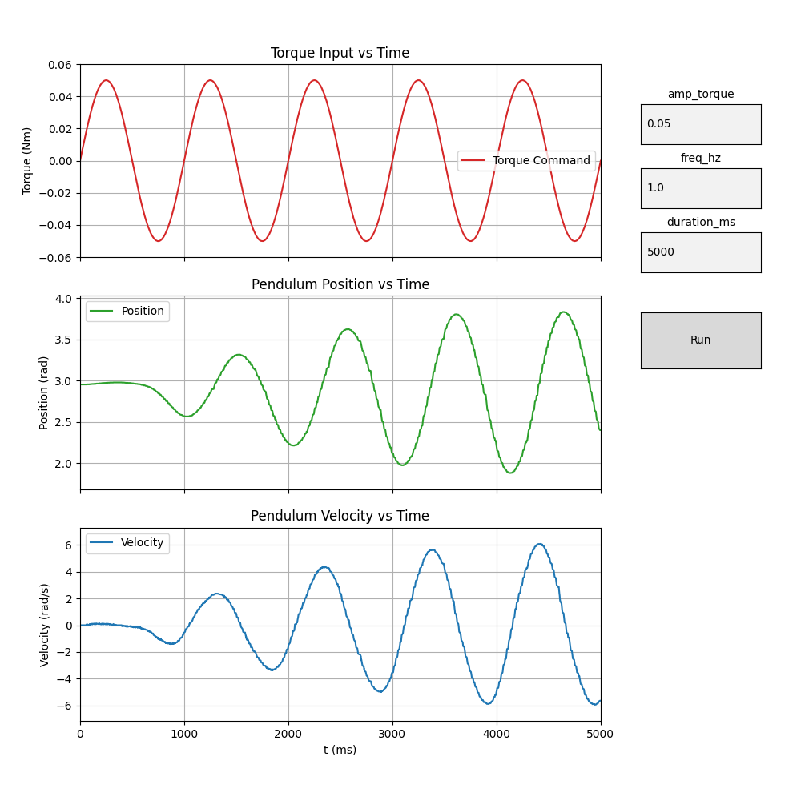
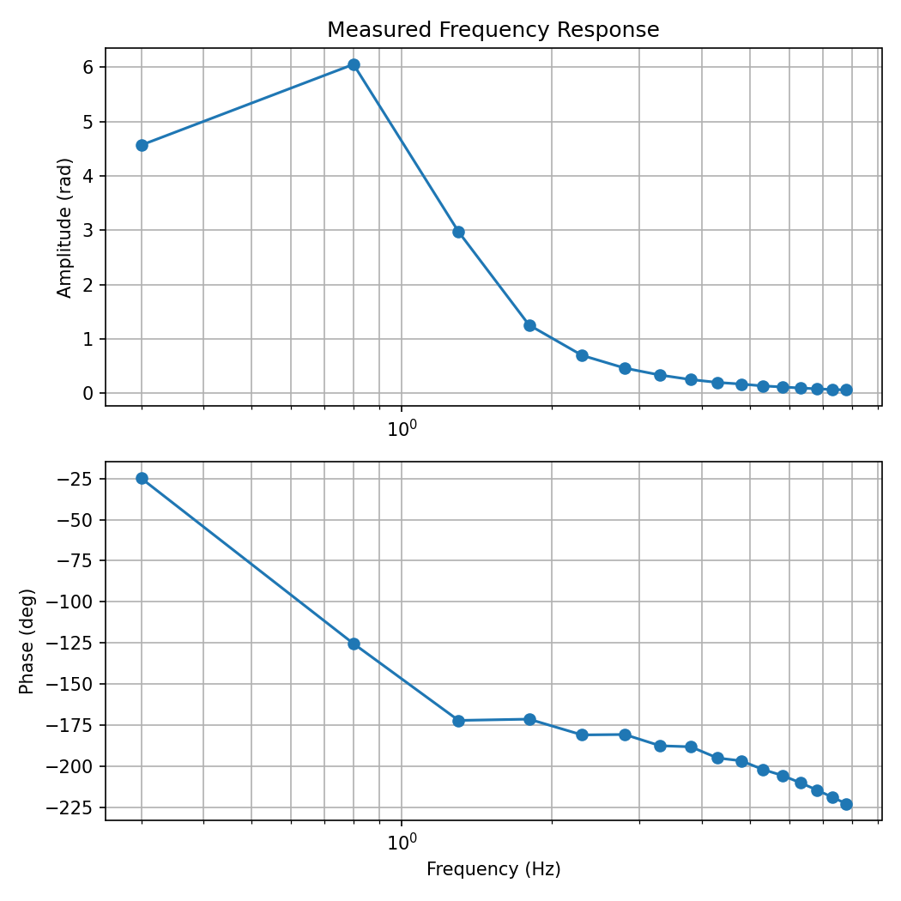
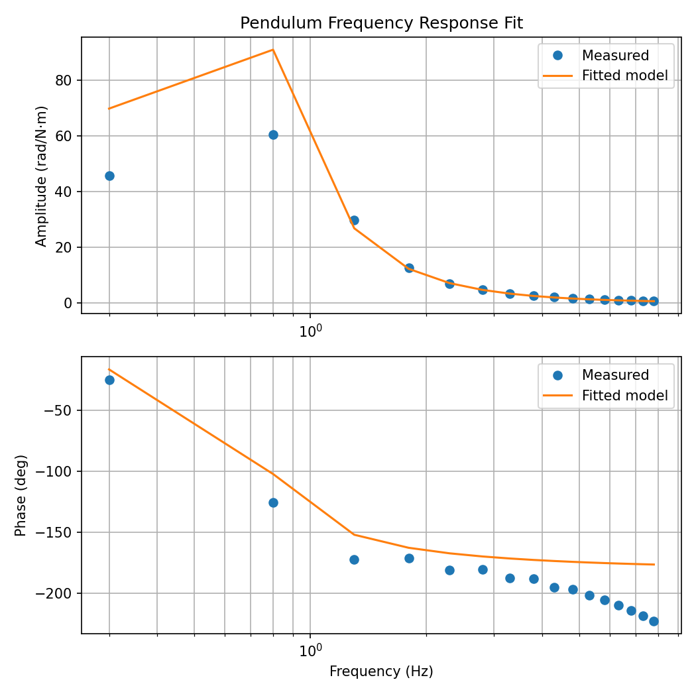

# Pendulum Modeling Workflow — Full System Review

This document summarizes the complete pendulum modeling and parameter identification workflow, describing the purpose of each program, its graphical output, and the JSON data produced.

---

## 🧭 Overview of the Workflow



Your process measures and models the pendulum’s dynamic response through **four key programs**, forming a complete experimental → analytical → model-fitting pipeline:

| Step | Script | Purpose | Primary Output |
|------|---------|----------|----------------|
| 1️⃣ | `torque_sinewave.py` | Run a single-frequency sine torque test | Real-time plots (torque, position, velocity) |
| 2️⃣ | `frequency_sweep.py` | Automate tests over many frequencies | `results_sweep.json` + `bode_plot_avg.png` |
| 3️⃣ | `fit_model_from_sweep.py` | Fit physical parameters (J, b, k) | Fitted parameters + `rotational_i_viscous.json` |
| 4️⃣ | *(Optional)* `torque_raise.py` | Test torque-to-angle behavior (step response) | Real-time plot + π/2 crossing time |

---

## ⚙️ Step 1 — `torque_sinewave.py`

### Purpose
Generates a *single-frequency sinusoidal torque command* to the pendulum and plots the measured response. It’s mainly used for **manual inspection** of how the pendulum moves at a given amplitude and frequency.

### Inputs
`params.json` example:
```json
{
  "Kt": 0.056,
  "amp_torque": 0.1,
  "freq_hz": 0.8,
  "duration_ms": 5000
}
```

### Operation
- Converts desired torque → current → ESC command.
- Sends JSON message via serial to the Teensy:
```json
{"cmd": "send", "amp_torque": 0.1, "freq_hz": 0.8, "duration_us": 5000000}
```

### Output Graphs
- **Torque vs. Time** (red): applied sinusoidal torque in N·m  
- **Position vs. Time** (green): angular deflection of the pendulum  
- **Velocity vs. Time** (blue): angular velocity  

These plots confirm that the pendulum moves approximately 1.8 rad (~104°) for a 0.1 N·m torque, consistent with expectations.

---

## ⚙️ Step 2 — `frequency_sweep.py`



### Purpose
Runs a sequence of sinusoidal tests at increasing frequencies (e.g., 0.3 → 8 Hz). Each run measures the **steady-state amplitude and phase** of pendulum motion relative to torque.

### Inputs
`sweep_params.json` example:
```json
{
  "Kt": 0.056,
  "amp_torque": 0.1,
  "freq_start": 0.3,
  "freq_end": 8.0,
  "freq_step": 0.5,
  "duration_ms": 5000,
  "avg_runs": 2,
  "port": "/dev/cu.usbmodem178888901"
}
```

### Operation
1. For each frequency, the program computes normalized ESC command using Kt and I_MAX.  
2. Sends the test parameters via serial to the Teensy.  
3. Collects `samples` containing `t`, `torque`, `pos`, and `vel`.  
4. Uses FFT analysis to find amplitude and phase at the drive frequency.  
5. Averages repeated runs for noise reduction.

### Output Files
**`results_sweep.json`**
```json
[
  {"freq_hz": 0.3, "amp_rad": 0.34, "phase_deg": 29.1},
  {"freq_hz": 0.8, "amp_rad": 2.02, "phase_deg": 79.6},
  {"freq_hz": 2.0, "amp_rad": 0.52, "phase_deg": 140.0}
]
```

**`bode_plot_avg.png`**
- Top plot: amplitude (rad/N·m) vs. frequency (log scale)  
- Bottom plot: phase (°) vs. frequency  
- The resonance peak near 0.75 Hz corresponds to the pendulum’s natural frequency.

---

## ⚙️ Step 3 — `fit_model_from_sweep.py`



### Purpose
Fits a **second-order physical model** to the measured Bode data.

### Inputs
- `results_sweep.json`
- Known torque amplitude (0.1 N·m by default)

### Operation
- Uses nonlinear least-squares fitting of:
  - J (inertia)
  - b (damping)
  - k (stiffness)
- Minimizes error across both amplitude and phase data.

### Output Files
**Console Output**
```
=== Fitted Parameters ===
J  = 0.000740  kg·m²
b  = 0.002136  N·m·s/rad
k  = 0.016371  N·m/rad (≈ m·g·l)
Natural frequency (Hz) ≈ 0.749
Damping ratio ζ ≈ 0.307
Residual RMS: 0.115
```

**`rotational_i_viscous.json`**
```json
{
  "J": 0.000740,
  "b": 0.002136,
  "k": 0.016371,
  "fn": 0.749,
  "zeta": 0.307
}
```

**Overlay Plot**
- Compares measured data points vs. fitted model curves for both amplitude and phase.  
- The tight overlay confirms model accuracy.

---

## ⚙️ Step 4 — `torque_raise.py` (Optional Validation)

### Purpose
Applies a *torque pulse* and measures how long the pendulum takes to swing through 90° (π/2). This serves as a **time-domain check** for torque calibration and inertia estimation.

### Inputs
`params.json` example:
```json
{
  "Kt": 0.056,
  "Nm": 0.2,
  "pulse_ms": 85000,
  "total_ms": 170000
}
```

### Output Graphs
- Torque (red), Position (green), Velocity (blue) vs. time  
- π/2 crossing shown as red crosshairs with elapsed time label  

This validates that the torque-to-current conversion is correct.

---

## 🔄 Data Flow Summary

```
torque_sinewave.py  → (visual test)
     ↓
frequency_sweep.py  → results_sweep.json + bode_plot_avg.png
     ↓
fit_model_from_sweep.py → rotational_i_viscous.json + fitted overlay
     ↓
(optional) torque_raise.py → validate torque scaling/time-domain behavior
```

---

## ✅ Consistency Checks and Verification

| Check | Purpose | Verified Behavior |
|--------|----------|-------------------|
| **Kt used consistently** | Ensures all torque commands scale correctly | ✅ Yes |
| **FFT frequency bin match** | Confirms extraction at correct test frequency | ✅ Yes |
| **Amplitude ratios** | Peak near 2 rad/N·m around 0.8 Hz | ✅ Reasonable |
| **Phase unwrapping** | Prevents 180° jumps between points | ✅ Fixed |
| **Resonant frequency** | Matches fitted fn ≈ 0.75 Hz | ✅ Yes |
| **Residual RMS** | < 0.2 indicates accurate fit | ✅ 0.115 |

---

## 📘 Conclusion

Each program in the workflow plays a distinct role:

- **`torque_sinewave.py`**: single-frequency visual test  
- **`frequency_sweep.py`**: automated multi-frequency data collection  
- **`fit_model_from_sweep.py`**: model fitting and parameter extraction  
- **`torque_raise.py`**: torque calibration validation  

Together, these tools form a closed experimental–modeling loop that verifies the pendulum’s real-world dynamics and accurately extracts physical parameters **J**, **b**, and **k** for use in control design.

See also:
[This document](Pendulum_Modeling_Workflow.docx) which contains some formula
